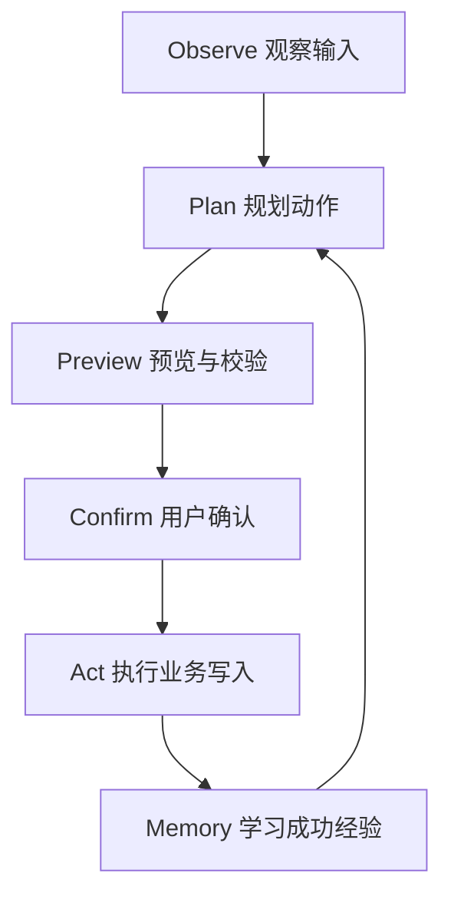
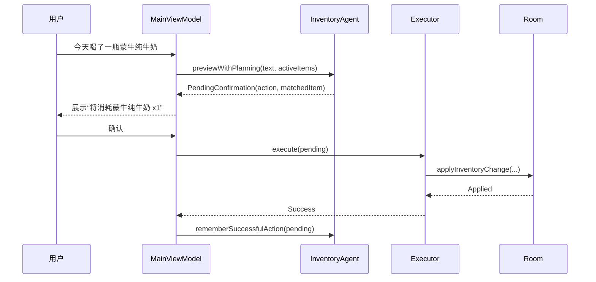
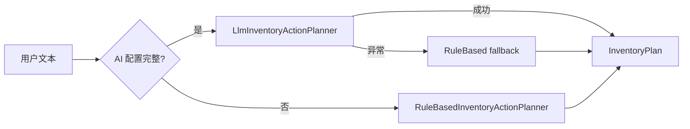

# Agent 开发总览

## 这个项目里的 Agent 是什么

在这个项目里，Agent 是一个受控的业务执行器。它不会自由聊天，也不会直接绕过业务层写数据库。它只做一件事：把用户的库存意图转换成一个可确认、可执行、可回滚到错误提示的结构化动作。

可以把它拆成六步：



这些步骤分别落在具体源码里：

| Agent 步骤 | 主要源码 | 说明 |
| --- | --- | --- |
| Observe | `MainViewModel.handleVoiceText()` | 接收 ASR 文本，截取当前库存快照 |
| Plan | `InventoryActionPlanner` | 本地规则或 LLM 生成 `InventoryAction` |
| Preview | `InventoryActionPreviewer` | 校验动作、匹配库存、处理候选冲突 |
| Confirm | `VoiceInputState.PendingConfirmation` | UI 展示待执行动作，等待用户确认 |
| Act | `InventoryActionExecutor` | 调用仓储接口执行新增、消耗、丢弃 |
| Memory | `RoomAgentMemoryStore` | 成功后学习别名和表达习惯 |

## 为什么要做确认层

很多 Agent 入门项目会让 LLM 直接调用工具，但真实业务里这很危险。库存应用虽然不是高危金融场景，但仍然涉及用户数据修改。这里采用“先预览、再确认、后执行”的模式。

一个典型流程是：



这条链路保证了三个边界：

1. **规划不等于执行**：LLM 或规则只返回计划。
2. **预览必须可解释**：UI 展示的是结构化动作，不是模型原文。
3. **写入必须经过业务校验**：数量、库存状态、并发冲突都在执行阶段再次判断。

## Agent 的输入输出协议

规划入口使用 `InventoryAgentRequest`：

```kotlin
data class InventoryAgentRequest(
    val recognizedText: String,
    val activeItems: List<Item>,
    val today: LocalDate = LocalDate.now(),
    val memories: List<AgentMemory> = emptyList()
)
```

这四个字段对应 Agent 所需上下文：

| 字段 | 为什么需要 |
| --- | --- |
| `recognizedText` | 用户本次说的话，是意图来源 |
| `activeItems` | 当前可操作库存，用于匹配和避免编造 |
| `today` | 解析“明天”“三天后”等相对日期 |
| `memories` | 用户过去的别名、简称和表达习惯 |

输出则集中到 `InventoryAction`：

```kotlin
sealed class InventoryAction {
    data class AddItem(val draft: ItemDraft) : InventoryAction()
    data class ConsumeItem(val itemName: String, val quantity: Int, val itemId: Long? = null) : InventoryAction()
    data class DiscardItem(val itemName: String, val quantity: Int, val itemId: Long? = null) : InventoryAction()
    data class AskClarification(val message: String) : InventoryAction()
}
```

如果规划不完整，输出 `AskClarification`，而不是猜测一个危险动作。

## 三种常见输入如何流转

| 用户输入 | 期望规划 | 后续处理 |
| --- | --- | --- |
| “买了两瓶牛奶，6 月 20 号过期” | `AddItem(ItemDraft(...))` | 校验日期和数量，确认后插入 Room |
| “喝了一瓶牛奶” | `ConsumeItem("牛奶", 1)` | 匹配活跃库存，确认后减少剩余数量 |
| “把过期的酸奶扔了” | `DiscardItem("酸奶", 1)` | 匹配库存，确认后标记丢弃 |

如果输入是“要不要扔掉牛奶”或“别把牛奶扔了”，规则和 LLM prompt 都要求返回澄清。这里的教学重点是：Agent 必须识别“非执行意图”。

## 本地规则和 LLM 的关系

项目默认可以只靠本地规则运行。LLM 是增强层，不是唯一依赖。



这个设计适合教学，因为你可以先讲清楚规则解析，再引入 LLM 的价值：

1. 规则解析稳定、可测试、低成本。
2. LLM 更擅长复杂自然语言和上下文推理。
3. 混合规划能避免“模型不可用时功能完全瘫痪”。

## 学习时要关注的工程问题

学习 Agent 时不要只看“模型能不能理解”。更重要的是下面这些工程问题：

| 问题 | 项目里的答案 |
| --- | --- |
| LLM 输出不合法怎么办 | `LlmInventoryActionJsonParser` 防御性解析，失败转澄清 |
| 用户说错了或只是提问怎么办 | 返回 `AskClarification` |
| 找到多个库存怎么办 | `NeedsSelection` 让用户选择 |
| 数量不够怎么办 | 预览和执行阶段都校验 |
| 记忆查询失败怎么办 | 记录日志，继续走空记忆 |
| LLM 网络失败怎么办 | `HybridInventoryActionPlanner` 回退到本地规则 |

## 本章练习

打开这些文件并画出自己的流程图：

- `app/src/main/java/com/jishiyong/agent/InventoryAgent.kt`
- `app/src/main/java/com/jishiyong/agent/InventoryActionPlanner.kt`
- `app/src/main/java/com/jishiyong/viewmodel/MainViewModel.kt`

重点找出一个边界：哪一行代码把“规划完成”转换成了“等待用户确认”。
