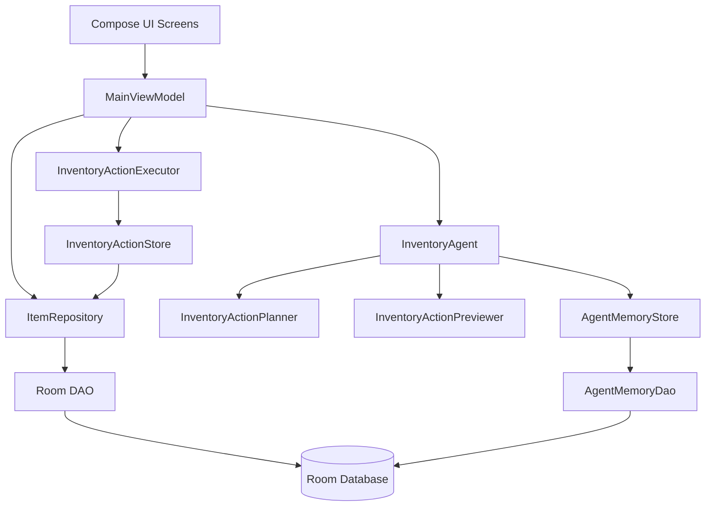

# 项目架构

## 总体分层

项目采用 Android 常见的 MVVM + Repository，同时把 Agent 放在 ViewModel 和数据层之间。Agent 不是 UI 的一部分，也不是数据库的一部分，它是“意图到动作”的业务规划层。



这个分层的关键点是：ViewModel 负责协调 UI 状态，Agent 负责理解意图，Executor 负责安全写入，Repository 负责持久化。

## 依赖从哪里组装

依赖组装集中在 `app/src/main/java/com/jishiyong/AppContainer.kt`。这让教学时可以从一个地方看到完整 Agent 组成。

简化后的构造逻辑如下：

```kotlin
private fun createInventoryAgent(): InventoryAgent {
    val parser = InventoryCommandParser(categoryInferencer)
    val itemMatcher = InventoryItemMatcher(categoryInferencer)
    val previewer = InventoryActionPreviewer(itemMatcher = itemMatcher)
    val fallbackPlanner = RuleBasedInventoryActionPlanner(parser)
    val aiConfiguration = AiAgentSettings(appContext).loadConfiguration(...)

    val planner = if (aiConfiguration.isComplete) {
        HybridInventoryActionPlanner(
            primary = LlmInventoryActionPlanner(...),
            fallback = fallbackPlanner,
            logger = logger
        )
    } else {
        fallbackPlanner
    }

    return InventoryAgent(
        planner = planner,
        memoryStore = RoomAgentMemoryStore(...),
        parser = parser,
        itemMatcher = itemMatcher,
        previewer = previewer,
        logger = logger,
        mode = mode
    )
}
```

这个构造方式体现了三条设计原则：

1. 默认可离线运行：AI 配置不完整时走本地规则。
2. LLM 是可替换组件：只要实现 `InventoryActionPlanner` 或 `LlmClient`。
3. 预览、匹配、记忆、执行拆开，便于单元测试。

## 核心模块职责

| 模块 | 文件 | 职责 |
| --- | --- | --- |
| 动作模型 | `InventoryAction.kt` | 定义新增、消耗、丢弃、澄清四类动作 |
| 请求上下文 | `InventoryAgentRequest.kt` | 包装文本、库存、日期、记忆 |
| Agent 门面 | `InventoryAgent.kt` | 读取记忆、调用 planner、预览结果、写入记忆 |
| 本地解析 | `InventoryCommandParser.kt` | 关键词、数量、日期、品类推断 |
| 混合规划 | `InventoryActionPlanner.kt` | 本地规则、LLM、fallback、诊断信息 |
| LLM 适配 | `agent/llm/*` | Prompt、HTTP client、JSON parser |
| 库存匹配 | `InventoryItemMatcher.kt` | ID、精确、包含、相似度匹配 |
| 动作预览 | `InventoryActionPreviewer.kt` | 校验、候选选择、错误提示 |
| 动作执行 | `InventoryActionExecutor.kt` | 调用仓储接口写入，并处理冲突结果 |
| 记忆系统 | `RoomAgentMemoryStore.kt` | 查询和写入别名记忆 |

## ViewModel 的位置

`MainViewModel` 是 UI 和业务能力的协调者。它不直接解析自然语言，而是把语音文本交给 Agent：

```kotlin
fun handleVoiceText(recognizedText: String) {
    val text = recognizedText.trim()
    _voiceInputState.value = VoiceInputState.Parsing(...)
    voiceParseJob = viewModelScope.launch {
        val itemsSnapshot = repository.getActiveItems().first()
        val preview = inventoryAgent.previewWithPlanning(text, itemsSnapshot)
        _voiceInputState.value = preview
    }
}
```

确认执行也在 ViewModel 中编排：

```kotlin
fun confirmVoiceAction() {
    val pending = _voiceInputState.value as? VoiceInputState.PendingConfirmation ?: return
    _voiceInputState.value = VoiceInputState.Executing(pending.recognizedText)
    viewModelScope.launch {
        val executionState = actionExecutor.execute(pending, actionStore)
        if (executionState is VoiceInputState.Success) {
            inventoryAgent.rememberSuccessfulAction(pending)
        }
        _voiceInputState.value = executionState
    }
}
```

这段代码展示了 Agent 工程里很重要的顺序：先执行成功，再学习记忆。失败的动作不会污染记忆库。

## 数据层和 Agent 的连接

Agent 不直接依赖 `ItemRepository`，而是依赖较窄的接口：

```kotlin
interface InventoryActionStore {
    suspend fun insert(item: Item): Long
    suspend fun applyInventoryChange(
        id: Long,
        quantity: Int,
        consumeType: ConsumeType
    ): InventoryChangeResult
}
```

`MainViewModel` 用匿名对象把 Repository 适配成这个接口。这样做的好处是：

1. Executor 单元测试可以传入假的 store。
2. Agent 执行层不需要知道 Repository 的完整能力。
3. 后续换数据源时影响面更小。

## 为什么不是把所有逻辑放进一个 Agent 类

教学中很容易把 Agent 写成一个巨大类：录音、解析、调用模型、查数据库、写数据库全部塞进去。这个项目刻意拆开，是因为真实业务最需要的是可定位、可测试、可替换。

| 如果混在一起 | 当前拆分后的结果 |
| --- | --- |
| LLM 失败难以定位 | `HybridInventoryActionPlanner` 单独记录 fallback 诊断 |
| 解析规则难测 | `InventoryCommandParserTest` 可直接测规则 |
| 库存匹配难复用 | `InventoryItemMatcher` 单独封装 |
| 写入错误混杂在规划里 | `InventoryActionExecutor` 统一处理执行结果 |
| 记忆污染风险高 | 只有成功执行后才 `rememberSuccessfulAction` |

## 架构阅读顺序

建议按这个顺序读源码：

1. `InventoryAction.kt`：先看动作协议。
2. `InventoryAgent.kt`：看 Agent 门面如何组织规划和预览。
3. `MainViewModel.kt`：看 UI 状态如何驱动 Agent。
4. `InventoryActionPlanner.kt`：看规则和 LLM 的组合。
5. `InventoryActionExecutor.kt`：看真正写入前后的安全处理。
6. `RoomAgentMemoryStore.kt`：看执行成功后的学习闭环。
