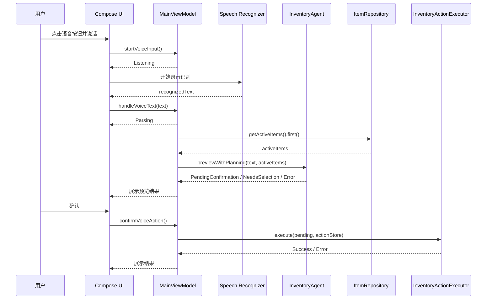
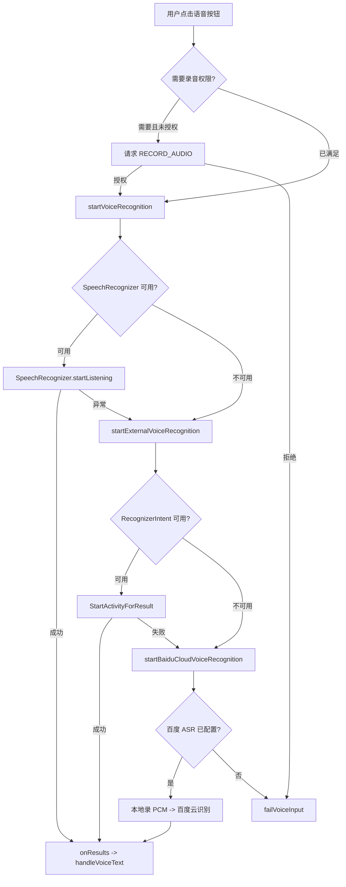
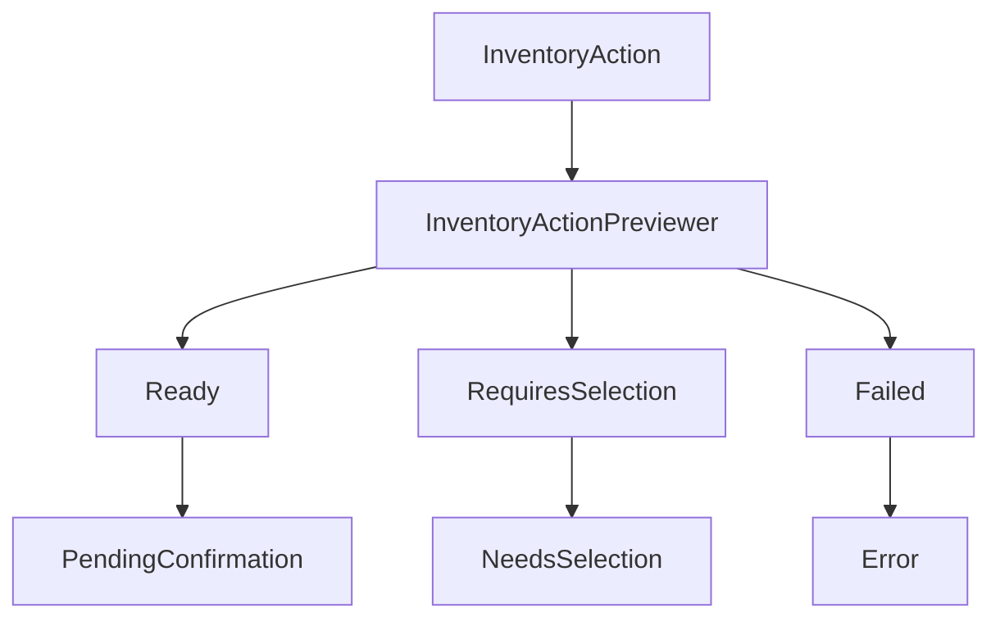

# 语音到动作

## 一句话的完整旅程

以“今天喝了一瓶蒙牛纯牛奶”为例，系统要完成的不是简单文本匹配，而是一条带状态管理、库存上下文、确认和执行的链路。



## 语音入口有三条路径

`HomeScreen` 并不是只依赖单一语音识别能力。它按可用性和异常情况组织了三条路径：



这三条路径分别对应：

| 路径 | 源码 | 说明 |
| --- | --- | --- |
| 内嵌系统识别 | `SpeechRecognizer.createSpeechRecognizer()` | App 内直接监听结果和错误 |
| 外部系统识别 | `RecognizerIntent.ACTION_RECOGNIZE_SPEECH` | 通过系统语音识别 Activity 返回结果 |
| 百度云识别 | `BaiduCloudSpeechRecognizer.recognizeOnce()` | 本地录 PCM，再调用百度 ASR |

所有路径最终都收敛到同一个入口：

```kotlin
viewModel.handleVoiceText(text)
```

这就是架构上最重要的约束：ASR 可以替换，但 Agent 后续链路不应该跟着变。

## UI 状态机

语音入口的状态定义在 `VoiceInputState.kt`：

```kotlin
sealed class VoiceInputState {
    data object Idle : VoiceInputState()
    data object Listening : VoiceInputState()
    data object Recognizing : VoiceInputState()
    data class Parsing(...) : VoiceInputState()
    data class PendingConfirmation(...) : VoiceInputState()
    data class NeedsSelection(...) : VoiceInputState()
    data class Executing(val recognizedText: String) : VoiceInputState()
    data class Success(val message: String) : VoiceInputState()
    data class Error(val message: String, val recognizedText: String? = null) : VoiceInputState()
}
```

状态设计要点：

| 状态 | 业务含义 | UI 应该做什么 |
| --- | --- | --- |
| `Listening` | 正在录音 | 展示录音中反馈 |
| `Recognizing` | 音频转文字中 | 展示识别中 |
| `Parsing` | 文本转结构化动作 | 展示本地规则或 AI 解析中 |
| `PendingConfirmation` | 已得到可执行动作 | 展示动作详情和确认按钮 |
| `NeedsSelection` | 匹配到多个候选库存 | 让用户选择具体库存 |
| `Executing` | 正在写入数据 | 禁用重复提交 |
| `Success` | 执行完成 | 展示成功信息 |
| `Error` | 解析、匹配或执行失败 | 展示可恢复错误 |

## 从文本进入 Agent

`MainViewModel.handleVoiceText()` 先做输入清洗和空文本保护：

```kotlin
val text = recognizedText.trim()
if (text.isBlank()) {
    _voiceInputState.value = VoiceInputState.Error("没有识别到语音内容，请重试")
    return
}
```

然后进入解析状态：

```kotlin
_voiceInputState.value = VoiceInputState.Parsing(
    recognizedText = text,
    parserLabel = inventoryAgent.mode.displayName,
    messagePrefix = inventoryAgent.mode.parsingMessagePrefix
)
```

`parserLabel` 和 `messagePrefix` 来自 `InventoryAgentMode`，用于区分“本地规则解析”和“AI 解析 + 本地兜底”。这对教学很有帮助：用户能看到当前是哪种规划模式。

## 语音识别错误如何进入状态机

系统识别错误会被转换成用户可理解的文案：

```kotlin
private fun speechErrorText(error: Int): String {
    return when (error) {
        SpeechRecognizer.ERROR_AUDIO -> "录音失败，请重试"
        SpeechRecognizer.ERROR_INSUFFICIENT_PERMISSIONS -> "缺少录音权限"
        SpeechRecognizer.ERROR_NETWORK,
        SpeechRecognizer.ERROR_NETWORK_TIMEOUT -> "语音识别网络异常，请稍后再试"
        SpeechRecognizer.ERROR_NO_MATCH -> "没有识别到可用语音内容，请重试"
        else -> "语音识别失败，请重试"
    }
}
```

百度云路径则在 `BaiduCloudSpeechRecognizer` 内完成两步：

```kotlin
val audio = recorder.recordSpeechPcm(appContext)
return client.recognizePcm(audio, configuration)
```

`PcmSpeechRecorder` 会限制最长录音时长，并用简单音量阈值判断是否捕获到语音。识别失败不会进入 Agent，而是直接进入 `VoiceInputState.Error`。

## 为什么要取库存快照

在规划前，ViewModel 会读取当前活跃库存：

```kotlin
val itemsSnapshot = repository.getActiveItems().first()
val preview = inventoryAgent.previewWithPlanning(text, itemsSnapshot)
```

这样做是为了让 Agent 能回答三个问题：

1. “喝了一瓶牛奶”到底匹配哪条库存？
2. 这条库存还有没有足够数量？
3. 如果有多个牛奶，是否需要用户选择？

如果读取数据库失败，代码会降级使用 `allActiveItems.value`。这不是完美数据，但能避免一次数据库读取异常直接打断语音流程。

## Agent 预览阶段

`InventoryAgent.previewWithPlanning()` 做了两件事：

```kotlin
val memories = memoryStore.relevantMemoriesFor(text, activeItems)
val request = InventoryAgentRequest(
    recognizedText = text,
    activeItems = activeItems,
    memories = memories
)
return preview(request)
```

先查记忆，再构造请求。记忆不是强制依赖，读取失败会记录日志并使用空列表继续。这符合 Agent 的工程化原则：增强能力失败不能破坏主流程。

预览结果有三类：



## 候选选择

当用户说“喝了一瓶牛奶”，但库存里有“蒙牛纯牛奶”和“燕塘鲜牛奶”，匹配器可能返回 `NeedsSelection`。

用户选择后，ViewModel 会把候选转回待确认状态：

```kotlin
fun selectVoiceCandidate(item: Item) {
    val currentState = _voiceInputState.value as? VoiceInputState.NeedsSelection ?: return
    if (currentState.candidates.none { it.id == item.id }) return

    _voiceInputState.value = VoiceInputState.PendingConfirmation(
        recognizedText = currentState.recognizedText,
        action = currentState.action,
        matchedItem = item,
        diagnostics = currentState.diagnostics
    )
}
```

注意这里不会重新规划，只是把用户选择的 `matchedItem` 合入确认状态。

## 确认执行

确认后才进入 `InventoryActionExecutor`：

```kotlin
val executionState = actionExecutor.execute(pending, actionStore)
if (executionState is VoiceInputState.Success) {
    inventoryAgent.rememberSuccessfulAction(pending)
}
```

这段代码有两个重要细节：

1. 只有 `PendingConfirmation` 能执行。
2. 只有执行成功才写入记忆。

这能避免“用户取消”“匹配错误”“数量不足”等失败路径污染长期记忆。

## 常见失败路径

| 场景 | 状态 | 典型提示 |
| --- | --- | --- |
| ASR 没有识别到文字 | `Error` | 没有识别到语音内容，请重试 |
| 用户只是提问 | `Error` | 请确认是否要执行库存新增、消耗或丢弃操作 |
| 新增缺少过期日期 | `Error` | 请补充物品的过期日期 |
| 找不到库存 | `Error` | 没有找到对应可用库存 |
| 多个候选 | `NeedsSelection` | 找到多个相关物品，请选择 |
| 数量不足 | `Error` | 剩余数量不足 |
| 写入冲突 | `Error` | 库存刚刚发生变化，请重新确认 |

## 本章练习

选择一条语音输入，例如：

```text
昨天买了两盒酸奶，三天后过期
```

然后按下面问题追踪源码：

1. `MainViewModel` 什么时候进入 `Parsing`？
2. `InventoryCommandParser` 如何解析购买日期和过期日期？
3. `InventoryActionPreviewer` 会不会要求匹配已有库存？
4. 用户确认后最终调用的是 `insert` 还是 `applyInventoryChange`？
