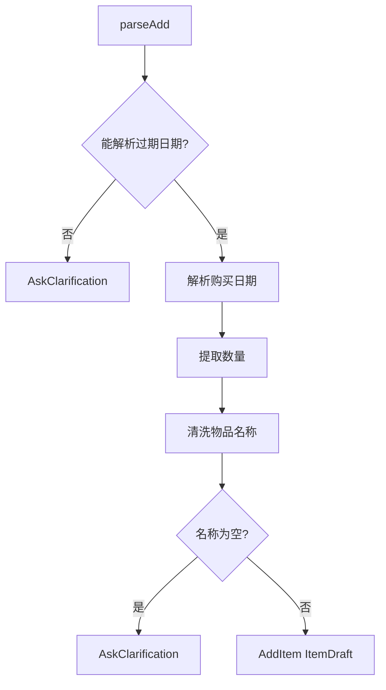
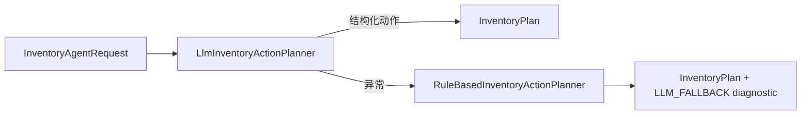
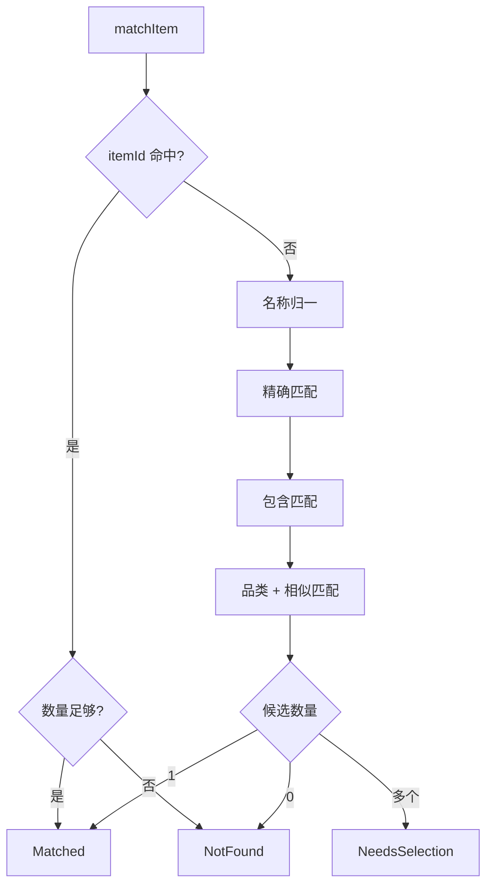

# 解析与规划

## 规划层的目标

规划层的输出只有一个：`InventoryPlan`。

```kotlin
data class InventoryPlan(
    val action: InventoryAction,
    val diagnostics: List<InventoryPlanningDiagnostic> = emptyList()
)
```

`action` 是业务动作，`diagnostics` 是给 UI 或日志看的辅助信息，比如 LLM 失败后使用了本地兜底。把动作和诊断拆开，可以避免用户界面直接依赖异常或模型原始输出。

## 本地规则解析入口

本地规则由 `InventoryCommandParser` 实现。入口逻辑很短：

```kotlin
fun parse(text: String, today: LocalDate = LocalDate.now()): InventoryAction {
    val normalized = normalize(text)
    if (normalized.isBlank()) {
        return InventoryAction.AskClarification("没有识别到语音内容，请重试")
    }
    if (normalized.hasCancellationIntent()) {
        return InventoryAction.AskClarification("已识别为取消或否定表达，请重新说明要执行的库存操作")
    }
    if (normalized.hasQuestionIntent()) {
        return InventoryAction.AskClarification("请确认是否要执行库存新增、消耗或丢弃操作")
    }

    return when {
        normalized.containsAny(addKeywords) -> parseAdd(normalized, today)
        normalized.containsAny(discardKeywords) -> parseDiscard(normalized)
        normalized.containsAny(consumeKeywords) -> parseConsume(normalized)
        else -> InventoryAction.AskClarification("暂时只能处理新增、消耗或丢弃库存")
    }
}
```

这里有一个值得学习的顺序：先处理空输入、取消、提问，再判断动作关键词。否则“不要喝牛奶”可能被错误识别为消耗牛奶。

## 新增解析

新增库存需要更多字段：

| 字段 | 来源 |
| --- | --- |
| `name` | 新增关键词后的文本，去掉数量、日期和语气词 |
| `category` | `CategoryInferencer` 根据名称推断 |
| `quantity` | 总数量表达或开头数量 |
| `purchaseDate` | “今天/昨天/前天/具体日期”，默认今天 |
| `expirationDate` | 必填，支持绝对日期和相对日期 |
| `reminderDays` | 使用默认提醒天数 |
| `note` | 某些数量歧义保留为备注 |

流程图：



新增是唯一强制要求过期日期的动作。这个规则很适合教学：Agent 必须知道什么时候不能继续猜。

## 消耗和丢弃解析

消耗与丢弃都属于“库存变化”，差异在最终 `ConsumeType`：

| 用户表达 | 动作 | 执行时类型 |
| --- | --- | --- |
| 喝了、吃了、用了、用掉了 | `ConsumeItem` | `USED_UP` |
| 扔了、丢了、倒掉了、废弃 | `DiscardItem` | `DISCARDED` |

解析时优先处理“把 X 喝了/扔了”这种句式：

```kotlin
private fun substringBetweenHandleAndKeyword(text: String, keywords: List<String>): String {
    val handleIndex = text.indexOf("把")
    if (handleIndex < 0) return ""
    ...
    return text.substring(handleIndex + 1, verbMatch.second)
}
```

这比简单截取动词后文本更适合中文口语。

## Planner 抽象

本地规则和 LLM 都实现同一个接口：

```kotlin
interface InventoryActionPlanner {
    suspend fun plan(request: InventoryAgentRequest): InventoryAction {
        return planWithDiagnostics(request).action
    }

    suspend fun planWithDiagnostics(request: InventoryAgentRequest): InventoryPlan
}
```

这个接口让调用方不关心规划来自规则还是模型。

## 混合规划

`HybridInventoryActionPlanner` 先调用 primary，一般是 LLM。如果 LLM 抛异常，则回退到 fallback，一般是本地规则：

```kotlin
return try {
    val primaryPlan = primary.planWithDiagnostics(request)
    ...
    primaryPlan
} catch (exception: Exception) {
    logger.warn("LLM inventory planner failed; using rule fallback", exception)
    fallback.planWithDiagnostics(request).withDiagnostic(
        InventoryPlanningDiagnostic(
            kind = InventoryPlanningDiagnosticKind.LLM_FALLBACK,
            message = "AI 解析失败，已使用本地规则解析",
            technicalMessage = exception.message
        )
    )
}
```

教学时可以把它理解为“能力增强层”：



## 匹配不属于规划本身

规划层可以输出：

```kotlin
InventoryAction.ConsumeItem(itemName = "牛奶", quantity = 1)
```

但它不直接保证这条库存存在。库存匹配在 `InventoryActionPreviewer` 里进行：

```kotlin
private fun previewInventoryChange(...) {
    return when (val match = itemMatcher.matchItem(...)) {
        is InventoryMatchResult.Matched -> ...
        is InventoryMatchResult.NeedsSelection -> ...
        is InventoryMatchResult.NotFound -> ...
    }
}
```

这是一条重要边界：规划可以表达意图，预览负责把意图绑定到真实库存。

## 匹配策略

`InventoryItemMatcher` 的匹配顺序如下：

1. 如果 LLM 给出了 `itemId`，先按 ID 找。
2. 对名称做紧凑化归一，尝试精确匹配。
3. 尝试包含关系，例如“牛奶”匹配“蒙牛纯牛奶”。
4. 根据品类和字符重叠做相似匹配。
5. 多个匹配返回 `NeedsSelection`。
6. 没有匹配返回 `NotFound`。



## 规划层测试重点

建议优先覆盖这些情况：

| 测试目标 | 对应测试文件 |
| --- | --- |
| 新增、消耗、丢弃关键词 | `InventoryCommandParserTest.kt` |
| 中文数字和数量单位 | `InventoryCommandParserTest.kt` |
| 相对日期和绝对日期 | `InventoryCommandParserTest.kt` |
| 否定和提问不执行 | `InventoryAgentTest.kt` |
| LLM JSON 防御性解析 | `LlmInventoryActionJsonParserTest.kt` |
| LLM 失败后规则兜底 | `LlmBackedInventoryAgentTest.kt` |

## 本章练习

给本地 parser 增加一个表达：“开了一瓶牛奶”应该被识别为消耗。你需要：

1. 在 `consumeKeywords` 增加关键词。
2. 在 `InventoryCommandParserTest.kt` 增加测试。
3. 检查“不要开牛奶”是否仍然走澄清，而不是执行消耗。
