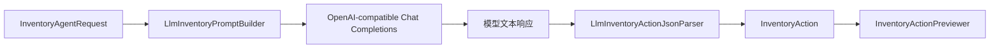
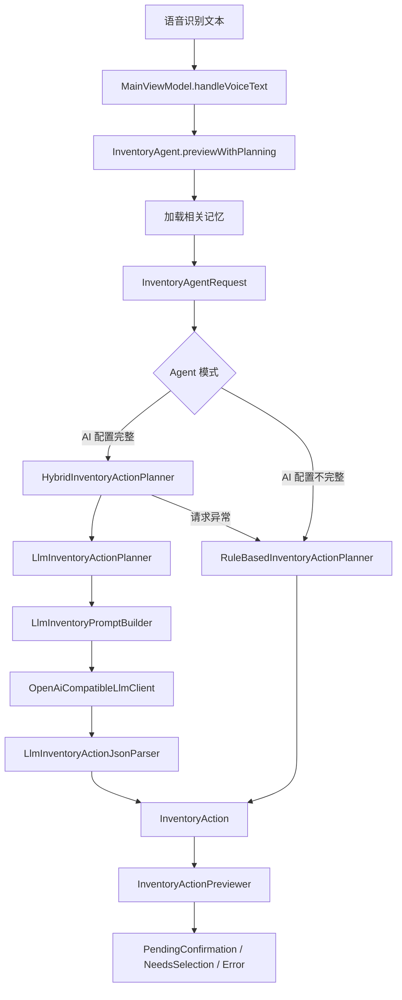
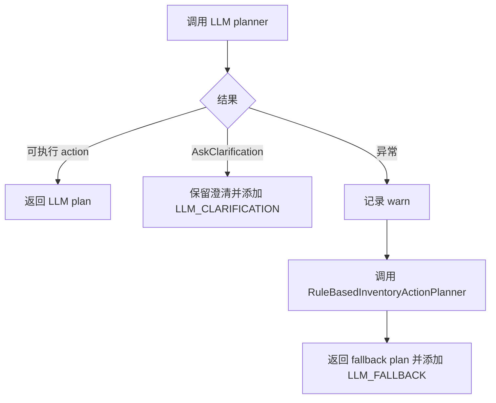

# 05. LLM 接入：让模型只做规划

相关源码：

- `app/src/main/java/com/jishiyong/AppContainer.kt`
- `app/src/main/java/com/jishiyong/agent/AiAgentSettings.kt`
- `app/src/main/java/com/jishiyong/agent/InventoryAction.kt`
- `app/src/main/java/com/jishiyong/agent/InventoryActionPlanner.kt`
- `app/src/main/java/com/jishiyong/agent/InventoryAgent.kt`
- `app/src/main/java/com/jishiyong/agent/InventoryAgentRequest.kt`
- `app/src/main/java/com/jishiyong/agent/InventoryPlanningDiagnostic.kt`
- `app/src/main/java/com/jishiyong/agent/llm/LlmClient.kt`
- `app/src/main/java/com/jishiyong/agent/llm/OpenAiCompatibleLlmClient.kt`
- `app/src/main/java/com/jishiyong/agent/llm/LlmInventoryActionPlanner.kt`
- `app/src/main/java/com/jishiyong/agent/llm/LlmInventoryPromptBuilder.kt`
- `app/src/main/java/com/jishiyong/agent/llm/LlmInventoryActionJsonParser.kt`
- `app/src/test/java/com/jishiyong/agent/LlmBackedInventoryAgentTest.kt`
- `app/src/test/java/com/jishiyong/agent/llm/LlmInventoryActionJsonParserTest.kt`

## 接入目标

LLM 在这个项目里只承担规划角色：把自然语言和上下文转换成一个 JSON 动作。它不直接访问数据库，不直接执行写入，也不把原始输出展示成业务结果。



这个边界让 LLM 变成可替换、可回退、可测试的组件。

## Agent 里的 LLM 边界

LLM 接入不是“把 App 交给模型操作”，而是把模型放到 planner 位置。完整链路如下：



这里有两个关键约束：

1. `LlmInventoryActionPlanner` 只返回 `InventoryAction`，不接触 DAO、Repository 或数据库。
2. `InventoryAction` 必须经过本地 preview 和用户确认，后续才会由执行器写入。

`InventoryAction.kt` 定义的 action 是 agent 的工具协议：

```kotlin
sealed class InventoryAction {
    data class AddItem(val draft: ItemDraft) : InventoryAction()
    data class ConsumeItem(val itemName: String, val quantity: Int, val itemId: Long? = null) : InventoryAction()
    data class DiscardItem(val itemName: String, val quantity: Int, val itemId: Long? = null) : InventoryAction()
    data class AskClarification(val message: String) : InventoryAction()
}
```

新增、消耗、丢弃、澄清这四类动作覆盖了当前语音库存场景。模型可以帮助判断“喝了”是消耗、“扔了”是丢弃、“买了”是新增，但不能越过这个协议输出自由格式指令。

## 运行时装配

LLM 是否启用由 `AppContainer.createInventoryAgent()` 决定。核心逻辑是：AI 配置完整时使用 LLM 优先、规则兜底；配置不完整时只使用本地规则。

```kotlin
val aiConfiguration = AiAgentSettings(appContext).loadConfiguration(
    defaultBaseUrl = BuildConfig.AI_API_BASE_URL,
    defaultModel = BuildConfig.AI_MODEL_NAME
)

val planner = if (aiConfiguration.isComplete) {
    HybridInventoryActionPlanner(
        primary = LlmInventoryActionPlanner(
            client = OpenAiCompatibleLlmClient(
                baseUrl = aiConfiguration.baseUrl,
                model = aiConfiguration.model,
                apiKey = aiConfiguration.apiKey
            ),
            promptBuilder = LlmInventoryPromptBuilder(),
            actionParser = LlmInventoryActionJsonParser(categoryInferencer)
        ),
        fallback = fallbackPlanner,
        logger = logger
    )
} else {
    fallbackPlanner
}
```

默认 base URL 和 model 来自 `app/build.gradle.kts`：

```kotlin
val aiApiBaseUrl = configValue("AI_API_BASE_URL", "https://api.edgefn.net/v1")
val aiModelName = configValue("AI_MODEL_NAME", "DeepSeek-V3.2")
```

API key 不通过 `BuildConfig` 打进 APK。`AiAgentSettings` 使用 Android Keystore 支持的 AES/GCM 保存 key，并迁移旧的明文 SharedPreferences 字段。这个设计让课程项目可以演示“客户端接入 provider”的完整流程，同时不鼓励把 secret 写死到源码里。

## Planner 接口

LLM planner 和规则 planner 共享同一个接口：

```kotlin
interface InventoryActionPlanner {
    suspend fun plan(request: InventoryAgentRequest): InventoryAction {
        return planWithDiagnostics(request).action
    }

    suspend fun planWithDiagnostics(request: InventoryAgentRequest): InventoryPlan
}
```

请求对象 `InventoryAgentRequest` 明确给出 planner 可以使用的上下文：

```kotlin
data class InventoryAgentRequest(
    val recognizedText: String,
    val activeItems: List<Item>,
    val today: LocalDate = LocalDate.now(),
    val memories: List<AgentMemory> = emptyList()
)
```

这里的 `today` 很重要。相对日期必须基于一个可测试的日期，而不是让模型自己猜“今天”是哪一天。`activeItems` 和 `memories` 也只用于规划上下文，最终库存是否存在、数量是否足够，仍然要由本地代码验证。

## OpenAI-compatible Client

HTTP 适配器在 `OpenAiCompatibleLlmClient.kt`。它使用 `/chat/completions` 接口：

```kotlin
val request = Request.Builder()
    .url("${baseUrl.trimEnd('/')}/chat/completions")
    .header("Authorization", "Bearer $apiKey")
    .post(buildRequestBody(messages, temperature).toString().toRequestBody(JSON_MEDIA_TYPE))
    .build()
```

请求体包含：

```kotlin
return JSONObject()
    .put("model", model)
    .put("temperature", temperature)
    .put("messages", jsonMessages)
```

当前规划器使用 `temperature = 0.0`，因为库存动作需要稳定输出，不需要创造性表达。

## Prompt 结构

Prompt 构造在 `LlmInventoryPromptBuilder.kt`。系统提示限定了四类 action：

| action | 用途 |
| --- | --- |
| `add_item` | 新增库存 |
| `consume_item` | 消耗库存 |
| `discard_item` | 丢弃库存 |
| `ask_clarification` | 信息不足、取消、提问或不应执行 |

用户消息不是直接拼自然语言，而是拼一个 JSON payload：

```kotlin
val payload = JSONObject()
    .put("today", request.today.toString())
    .put("recognized_text", request.recognizedText)
    .put("active_inventory", activeInventoryJson(request))
    .put("memories", memoriesJson(request))
```

这样做有两个好处：

1. 上下文结构清晰，模型更容易按字段理解。
2. active inventory 和 memories 有数量上限，避免 prompt 膨胀。

系统提示不是闲聊提示词，而是工具协议说明。它要求模型：

- 只能输出一个 JSON 对象。
- 支持 `add_item`、`consume_item`、`discard_item`、`ask_clarification`。
- category 只能是 `FOOD`、`DRINK`、`DAILY`、`MEDICINE`、`COSMETICS`、`ELECTRONICS`、`CLOTHING`、`OTHER`。
- 日期必须是 `YYYY-MM-DD`。
- 新增物品缺少过期日期时必须澄清。
- 消耗或丢弃时优先使用 `active_inventory` 中最匹配的 `id` 和 `name`，但不能编造库存。
- 否定、取消、阻止、提问类表达必须澄清。

典型新增动作：

```json
{
  "action": "add_item",
  "item": {
    "name": "低温酸奶",
    "category": "DRINK",
    "quantity": 4,
    "purchase_date": "2026-06-05",
    "expiration_date": "2026-06-12",
    "reminder_days": [7, 3, 1],
    "note": "一组"
  }
}
```

典型消耗动作：

```json
{
  "action": "consume_item",
  "item_id": 9,
  "item_name": "蒙牛牛奶",
  "quantity": 1
}
```

信息不足或不应执行时：

```json
{
  "action": "ask_clarification",
  "message": "请补充物品的过期日期"
}
```

## 为什么 active_inventory 很重要

消耗和丢弃必须作用于真实库存。Prompt 中会给模型最多 20 条活跃库存：

```kotlin
request.activeItems
    .sortedWith(compareBy<Item> { it.expirationDate })
    .take(MAX_ACTIVE_ITEMS_IN_PROMPT)
```

排序按过期日期靠前优先，符合库存管理逻辑：如果用户说“喝一瓶牛奶”，通常应该优先消耗更早过期的库存。

LLM 可以返回 `item_id`，但后续仍会经过 `InventoryItemMatcher` 和 `InventoryActionPreviewer`。也就是说，LLM 的 ID 只是计划的一部分，不是最终授权。

## Prompt 隐私裁剪

`active_inventory` 不是完整的 Room `Item`。`LlmInventoryPromptBuilder.activeInventoryJson()` 只发送：

- `id`
- `name`
- `category`
- `category_display_name`
- `remaining_quantity`
- `expiration_date`

它不会发送 `note`、`purchase_date`、`used_quantity`、图片路径、创建时间等字段。`LlmBackedInventoryAgentTest.promptOmitsNonEssentialPrivateInventoryFields()` 明确验证了这件事：

```kotlin
assertTrue(prompt.contains("蒙牛纯牛奶"))
assertTrue(prompt.contains("remaining_quantity"))
assertFalse(prompt.contains("放在厨房第二层"))
assertFalse(prompt.contains("purchase_date"))
assertFalse(prompt.contains("used_quantity"))
```

这是 LLM 工程里很重要的一课：上下文不是越多越好。发送给模型的信息应该足够完成规划，同时避免非必要隐私字段和干扰字段。

## JSON 防御性解析

LLM 输出可能出现这些问题：

1. 外面包了 Markdown code fence。
2. 前后加了解释文字。
3. 缺字段。
4. 字段类型错误。
5. 日期格式不合法。

`LlmInventoryActionJsonParser` 先提取第一个 JSON object：

```kotlin
private fun extractFirstJsonObject(content: String): String? {
    val fenced = Regex("""```(?:json)?\s*([\s\S]*?)```""")
        .find(content)
        ?.groupValues
        ?.getOrNull(1)
        ?.trim()
    val candidate = fenced ?: content.trim()
    if (candidate.startsWith("{") && candidate.endsWith("}")) return candidate
    ...
}
```

然后按 action 类型解析。如果无法解析，统一返回 `AskClarification`：

```kotlin
val root = try {
    JSONObject(jsonText)
} catch (_: Exception) {
    return InventoryAction.AskClarification("AI 未返回可执行的库存操作")
}
```

这比把异常抛给 UI 更适合用户体验，也更利于测试。

解析器还做了更多字段级防御：

- 新增物品缺少名称时要求确认物品名称。
- 新增物品缺少过期日期时要求补充日期。
- 数量必须是正整数，0、负数、非数字字符串都会澄清。
- 消耗和丢弃允许只给 `item_id`，因为后续本地 matcher 可以按 id 匹配。
- 消耗和丢弃缺少数量时默认 1。
- `reminder_days` 会过滤非正数、去重、排序；为空时使用默认提醒天数。
- 未知 action 统一返回“暂时只能处理新增、消耗或丢弃库存”。

这些防御对应 `LlmInventoryActionJsonParserTest` 中的测试：fenced JSON、缺过期日期、非法数量、残缺 JSON、只给 item id、负数数量、缺省数量等。

## API key 安全边界

AI 配置读取在 `AiAgentSettings.kt`。API key 使用 Android Keystore 加密保存：

```kotlin
val spec = KeyGenParameterSpec.Builder(
    KEY_ALIAS,
    KeyProperties.PURPOSE_ENCRYPT or KeyProperties.PURPOSE_DECRYPT
)
    .setBlockModes(KeyProperties.BLOCK_MODE_GCM)
    .setEncryptionPaddings(KeyProperties.ENCRYPTION_PADDING_NONE)
    .setKeySize(256)
    .build()
```

构建配置可以提供默认 base URL 和 model，但 API key 不应该打包进 APK。真实 LLM smoke test 使用 GitHub Actions secret `AI_API_KEY`。

## 失败回退

LLM 失败不应该让语音库存功能完全不可用。`HybridInventoryActionPlanner` 的 fallback 机制会把异常转成诊断信息：

```kotlin
InventoryPlanningDiagnostic(
    kind = InventoryPlanningDiagnosticKind.LLM_FALLBACK,
    message = "AI 解析失败，已使用本地规则解析",
    technicalMessage = exception.message
)
```

这让 UI 可以告诉用户“已使用本地规则解析”，同时保留技术信息给日志或调试。

`HybridInventoryActionPlanner` 对“模型明确要求澄清”和“模型请求失败”做了区分：



如果模型返回 `ask_clarification`，系统不会强行 fallback 到规则解析。原因是模型已经判断这句话可能信息不足或不应执行，例如“别把牛奶扔了”“要不要丢掉牛奶”。这时让规则 parser 硬解析成丢弃动作，反而会绕开安全边界。

`LlmBackedInventoryAgentTest.hybridPlannerFallsBackWhenLlmRequestFails()` 覆盖了网络失败走 fallback；`hybridPlannerKeepsExplicitLlmClarification()` 覆盖了模型澄清不 fallback。

## 从计划到确认

LLM planner 返回 action 后，`InventoryAgent` 会交给 `InventoryActionPreviewer`：

```kotlin
return when (val preview = previewer.preview(plan.action, activeItems)) {
    is InventoryActionPreview.Ready -> VoiceInputState.PendingConfirmation(...)
    is InventoryActionPreview.RequiresSelection -> VoiceInputState.NeedsSelection(...)
    is InventoryActionPreview.Failed -> VoiceInputState.Error(preview.message, recognizedText)
}
```

这一步会检查：

- 新增草稿是否合法。
- 消耗或丢弃的库存是否存在。
- 多个候选是否需要用户选择。
- 操作数量是否超过剩余数量。

所以即使模型给出了 `item_id`，也不是直接执行。`LlmBackedInventoryAgentTest.previewWithPlanningUsesItemIdBeforeNameMatching()` 验证了 id 优先匹配，但匹配结果仍然进入 `PendingConfirmation`，等待用户确认。

## 接入另一个模型服务

只要服务兼容 OpenAI Chat Completions，一般只需要改配置：

| 配置 | 说明 |
| --- | --- |
| `AI_API_BASE_URL` | 例如 `https://api.example.com/v1` |
| `AI_MODEL_NAME` | 模型名称 |
| `AI_API_KEY` | 只通过安全配置或 CI secret 提供 |

如果服务协议不兼容，就新增一个 `LlmClient` 实现：

```kotlin
interface LlmClient {
    suspend fun complete(
        messages: List<LlmMessage>,
        temperature: Double
    ): String
}
```

只要返回模型内容字符串，后面的 JSON parser 和 planner 都可以复用。

## Smoke test

真实模型调用不放进普通单元测试，避免 CI 依赖外部服务。项目提供单独 workflow：

```bash
gh workflow run llm-smoke.yml \
  --ref main \
  -f ai_api_base_url="https://api.edgefn.net/v1" \
  -f ai_model_name="DeepSeek-V3.2" \
  -f recognized_text="今天喝了一瓶蒙牛纯牛奶"
```

普通构建也可以手动打开真实 LLM smoke：

```bash
gh workflow run build.yml \
  --ref "$(git branch --show-current)" \
  -f run_real_llm_smoke=true
```

## 本章练习

修改 prompt，让 LLM 在“用户提问”场景必须返回 `ask_clarification`，然后补一个测试：

```text
要不要把牛奶扔掉？
```

期望结果不是 `discard_item`，而是澄清动作。

## 学习重点

LLM 接入章的核心不是某个 provider，而是这套工程边界：

1. 用 `InventoryActionPlanner` 把模型接入变成可替换实现。
2. 用 prompt 约束输出协议，但用 Kotlin parser 强制校验。
3. 用 Hybrid fallback 区分“请求失败”和“模型要求澄清”。
4. 用 preview 和 confirmation 隔离 AI 理解能力与数据库写入权。

这套模式可以迁移到其他 agent 场景：让模型负责规划，让本地代码负责工具执行、权限、确认、并发和错误恢复。
