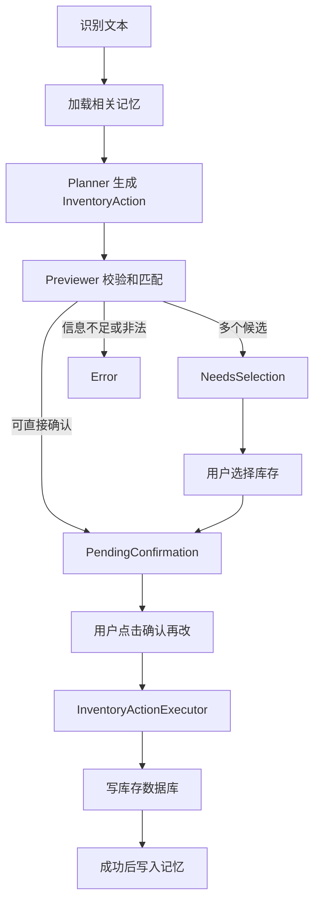
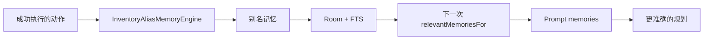
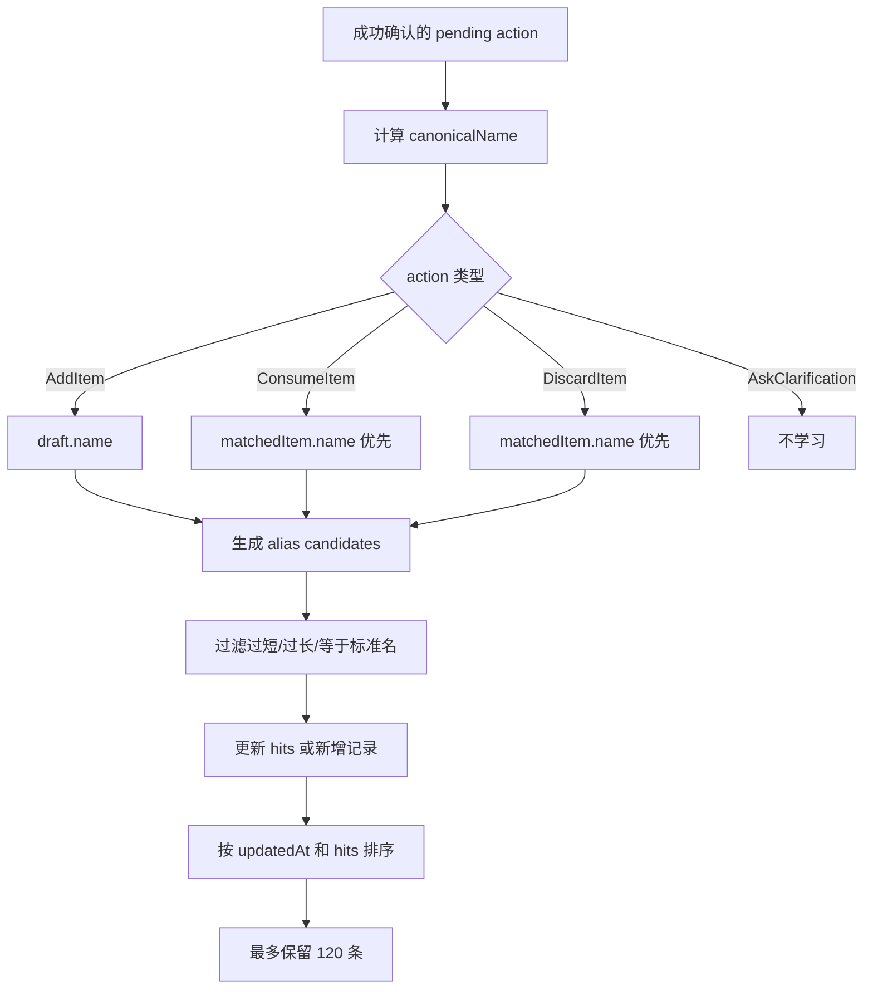
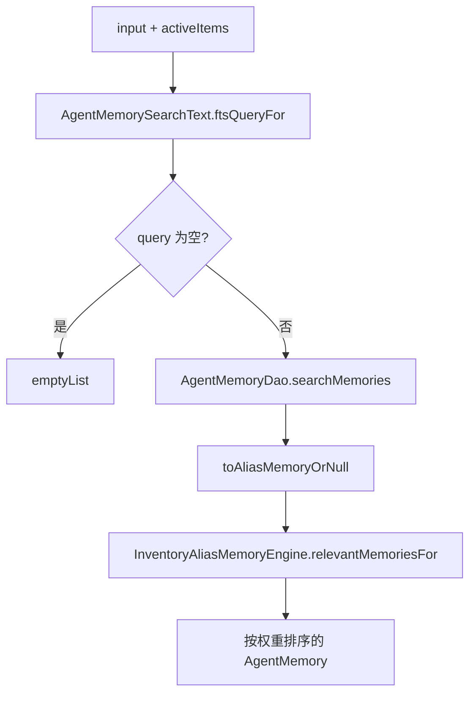
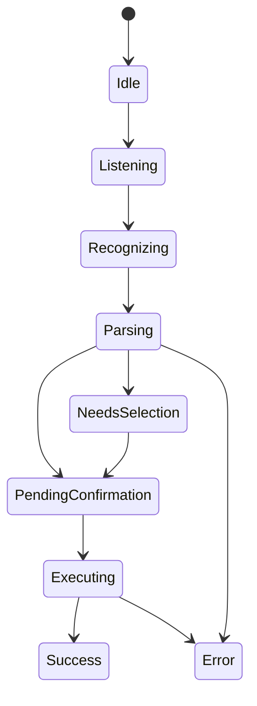

# 06. 记忆与确认执行：让 agent 学习，但不越权

相关源码：

- `app/src/main/java/com/jishiyong/agent/AgentMemory.kt`
- `app/src/main/java/com/jishiyong/agent/AgentMemorySearchText.kt`
- `app/src/main/java/com/jishiyong/agent/InventoryAliasMemoryEngine.kt`
- `app/src/main/java/com/jishiyong/agent/RoomAgentMemoryStore.kt`
- `app/src/main/java/com/jishiyong/data/db/entity/AgentMemoryEntity.kt`
- `app/src/main/java/com/jishiyong/data/db/dao/AgentMemoryDao.kt`
- `app/src/main/java/com/jishiyong/data/db/AppDatabase.kt`
- `app/src/main/java/com/jishiyong/agent/InventoryActionPreviewer.kt`
- `app/src/main/java/com/jishiyong/agent/InventoryItemMatcher.kt`
- `app/src/main/java/com/jishiyong/agent/InventoryActionExecutor.kt`
- `app/src/main/java/com/jishiyong/agent/VoiceInputState.kt`
- `app/src/main/java/com/jishiyong/viewmodel/MainViewModel.kt`
- `app/src/main/java/com/jishiyong/ui/screens/HomeScreen.kt`
- `app/src/test/java/com/jishiyong/agent/InventoryAliasMemoryEngineTest.kt`
- `app/src/test/java/com/jishiyong/agent/RoomAgentMemoryStoreTest.kt`
- `app/src/test/java/com/jishiyong/agent/InventoryActionExecutorTest.kt`

本章讲三件容易被混在一起的事：记忆、确认、执行。这套文档把它们拆开，是为了保证 agent 可以学习用户习惯，但不能因为学到了某个习惯就直接修改库存。



## 为什么需要记忆

用户不会总是说库存里的完整名称。例如库存名称是“蒙牛纯牛奶”，用户可能说：

- “喝了一瓶蒙牛”
- “把纯牛奶用了”
- “今天喝了一瓶早餐奶”

记忆系统的目标不是替代匹配器，而是把用户过去确认过的表达提供给下一次规划。



## 记忆接口

Agent 只依赖一个窄接口：

```kotlin
interface AgentMemoryStore {
    suspend fun relevantMemoriesFor(
        input: String,
        activeItems: List<Item>
    ): List<AgentMemory>

    suspend fun rememberSuccessfulAction(
        recognizedText: String,
        action: InventoryAction,
        matchedItem: Item?
    )
}
```

这个接口刻意不暴露 Room 细节。Agent 只关心“给我相关记忆”和“帮我记住成功动作”。

当前实现的记忆不是聊天历史，而是领域化的 alias memory：

```kotlin
data class InventoryAliasMemory(
    val alias: String,
    val canonicalName: String,
    val categoryName: String? = null,
    val hits: Int = 1,
    val updatedAt: Long = System.currentTimeMillis()
)
```

它记录的是“用户说法 -> 库存标准名”。比如用户确认“常买的奶”对应“蒙牛纯牛奶”后，下一次 prompt 可以注入：

```text
用户说“常买的奶”时通常指库存“蒙牛纯牛奶”，分类 DRINK。
```

这种记忆比保存完整对话更适合移动端实战：

- 保存内容短，容易解释。
- 检索结果少，prompt 成本低。
- 不会把无关对话或隐私备注长期注入模型。
- 即使记忆命中，后续仍然要经过本地匹配和用户确认。

## 成功后才学习

`MainViewModel.confirmVoiceAction()` 里有一个重要顺序：

```kotlin
val executionState = actionExecutor.execute(pending, actionStore)
if (executionState is VoiceInputState.Success) {
    inventoryAgent.rememberSuccessfulAction(pending)
}
```

这能避免错误记忆：

| 场景 | 是否学习 | 原因 |
| --- | --- | --- |
| 用户确认并成功消耗 | 是 | 表达和库存绑定经过验证 |
| 找不到库存 | 否 | 没有可信的 canonical name |
| 用户取消 | 否 | 没有执行意图 |
| 数量不足 | 否 | 本次动作没有成功 |
| 写入冲突 | 否 | 结果不确定 |

`InventoryAgent.rememberSuccessfulAction()` 还刻意吞掉普通异常并记录日志。源码中的注释说明了设计意图：

```kotlin
// A memory write should never affect an already confirmed inventory operation.
```

这是一条重要原则：记忆是增强能力，不是库存交易的一部分。库存已经成功修改后，记忆写入失败不能反过来让用户看到操作失败。

## 别名提取流程

`InventoryAliasMemoryEngine.learnFromAction()` 的学习流程如下：



候选 alias 来自两个地方：

1. action 中的物品名称，比如 `ConsumeItem.itemName = "常买的奶"`。
2. 清理后的原始识别文本，比如“我喝了一瓶常买的奶”清理成“常买的奶”。

清理时会移除日期、数量、标点和命令噪声词，例如“帮我”“今天”“买了”“喝了”“扔掉”“过期”“里面有”“把”“了”“的”等。最后还会过滤长度小于 2、大于 24、或与标准名 compact 后完全相同的候选。

`InventoryAliasMemoryEngineTest.learnConsumeActionStoresAliasForMatchedItem()` 验证了“常买的奶 -> 蒙牛纯牛奶”的学习；`repeatedLearningUpdatesExistingRecordHits()` 验证重复学习会增加 `hits` 并更新 `updatedAt`。

## Room 存储结构

记忆实体在 `AgentMemoryEntity.kt`：

```kotlin
@Entity(
    tableName = "agent_memories",
    indices = [Index(value = ["type", "key"])]
)
data class AgentMemoryEntity(
    @PrimaryKey(autoGenerate = true)
    val id: Long = 0,
    val type: String,
    val key: String,
    val valueJson: String,
    val searchableText: String,
    val confidence: Float,
    val hits: Int,
    val updatedAt: Long
)
```

同时还有 FTS 表：

```kotlin
@Fts4
@Entity(tableName = "agent_memory_fts")
data class AgentMemoryFtsEntity(
    @PrimaryKey
    @ColumnInfo(name = "rowid")
    val rowId: Long,
    val searchableText: String
)
```

FTS 用于快速找候选记忆，`InventoryAliasMemoryEngine` 再做二次打分。

`AgentMemoryDao.replaceAllMemories()` 会同时重写主表和 FTS 表：

```kotlin
val ids = insertMemories(memories.map { it.copy(id = 0) })
insertFtsEntries(
    ids.zip(memories).map { (id, memory) ->
        AgentMemoryFtsEntity(
            rowId = id,
            searchableText = memory.searchableText
        )
    }
)
```

这里使用 FTS 表的 `rowid` 对齐主表 id，便于搜索后 join 回完整记忆实体。`AppDatabase.MIGRATION_1_2` 创建了 `agent_memories`、`agent_memory_fts` 和索引，迁移测试 `AppDatabaseMigrationTest` 验证旧库存数据保留，并且新记忆 FTS 可以搜索。

## 记忆查询

`RoomAgentMemoryStore.relevantMemoriesFor()` 的流程：



查询失败时不会让主流程失败：

```kotlin
catch (exception: Exception) {
    logger.warn("Failed to query Room agent memories", exception)
    emptyList()
}
```

这是一个好的 Agent 实践：记忆是增强能力，不是主流程的单点故障。

`AgentMemorySearchText` 会为中文短文本生成 compact token 和 2-gram：

```kotlin
fun ftsQueryFor(input: String, activeItems: List<Item>): String {
    val inputTokens = buildTokens(input)
    val activeItemTokens = activeItems
        .asSequence()
        .flatMap { buildTokens(it.name).asSequence() }
        .take(MAX_ACTIVE_ITEM_TOKENS)
        .toList()

    return (inputTokens + activeItemTokens)
        .distinct()
        .take(MAX_QUERY_TOKENS)
        .joinToString(" OR ") { quoteFtsToken(it) }
}
```

召回候选后，`InventoryAliasMemoryEngine.relevantMemoriesFor()` 再按业务相关性打分：

| 条件 | 加分 |
| --- | --- |
| 输入包含 alias，或 alias 包含输入 | `+6` |
| 输入包含 canonical name，或 canonical name 包含输入 | `+4` |
| 字符重叠达到阈值 | `+1` |
| 当前活跃库存支持 canonical name | `+3` |
| 历史 hits | 最多 `+1` |

最后按 `weight` 倒序取最多 8 条记忆。`RoomAgentMemoryStoreTest.recallsThroughFtsCandidates()` 验证了 FTS 召回和 engine 排序能组合工作。

## 别名学习

`InventoryAliasMemoryEngine.learnFromAction()` 会从成功动作中提取 canonical name 和 alias：

| 动作 | canonical name |
| --- | --- |
| 新增 | `action.draft.name` |
| 消耗 | `matchedItem?.name ?: action.itemName` |
| 丢弃 | `matchedItem?.name ?: action.itemName` |

然后从用户原始文本和动作名称中提取候选别名。重复命中会增加 `hits`：

```kotlin
mutableRecords[existingIndex] = existing.copy(
    hits = existing.hits + 1,
    updatedAt = now,
    categoryName = existing.categoryName ?: categoryName
)
```

记忆有上限：

```kotlin
.take(MAX_MEMORY_RECORDS)
```

这避免长期使用后本地记忆无限膨胀。

## 确认执行器

在进入执行器之前，agent 已经通过 `VoiceInputState` 表达了确认状态：



`PendingConfirmation` 保存识别文本、action、匹配库存和诊断信息：

```kotlin
data class PendingConfirmation(
    val context: VoiceCommandContext,
    val confirmation: InventoryActionConfirmation
) : VoiceInputState()
```

UI 在 `HomeScreen` 的确认卡片中展示：

```kotlin
UnderstandCard(
    rows = listOf(
        "识别到" to voiceInputState.recognizedText,
        "动作" to voiceActionTitle(voiceInputState.action),
        "结果" to voiceActionPreview(voiceInputState.action, voiceInputState.matchedItem)
    ),
    diagnostics = voiceInputState.diagnostics
)
```

确认按钮文案是“确认再改”。这句文案就是产品层面的安全边界：先展示理解结果，再由用户授权修改库存。

## 候选选择

如果用户说“喝了一瓶牛奶”，当前库存里有“蒙牛纯牛奶 250ml”和“伊利纯牛奶”，系统不能替用户直接选。

`InventoryActionPreviewer.previewInventoryChange()` 通过 `InventoryItemMatcher.matchItem()` 得到三类结果：

- `Matched`：唯一匹配，进入 `PendingConfirmation`。
- `NeedsSelection`：多个候选，进入 `VoiceInputState.NeedsSelection`。
- `NotFound`：没有合适库存，进入错误状态。

用户在 UI 中选择候选后，`MainViewModel.selectVoiceCandidate()` 会重新构造 `PendingConfirmation`，不会重新调用 LLM：

```kotlin
_voiceInputState.value = VoiceInputState.PendingConfirmation(
    recognizedText = currentState.recognizedText,
    action = currentState.action,
    matchedItem = item,
    diagnostics = currentState.diagnostics
)
```

这体现了职责分离：模型负责规划，本地交互负责消解候选歧义。

## 执行器

执行器在 `InventoryActionExecutor.kt`。它只处理已经确认的动作：

```kotlin
suspend fun execute(
    pending: VoiceInputState.PendingConfirmation,
    store: InventoryActionStore
): VoiceInputState
```

执行器只接受 `PendingConfirmation`，不接受裸 `InventoryAction`。这可以防止调用方绕过确认层。

新增动作会把 `ItemDraft` 转成 Room `Item`：

```kotlin
store.insert(draft.toItem())
VoiceInputState.Success("已新增 ${draft.name} x${draft.quantity}")
```

消耗和丢弃走统一方法 `consumeOrDiscardItem()`，区别是 `ConsumeType`：

```kotlin
consumeType = ConsumeType.USED_UP
consumeType = ConsumeType.DISCARDED
```

执行器和数据层之间通过 `InventoryActionStore` 解耦：

```kotlin
interface InventoryActionStore {
    suspend fun insert(item: Item): Long
    suspend fun applyInventoryChange(id: Long, quantity: Int, consumeType: ConsumeType): InventoryChangeResult
}
```

因此 `InventoryActionExecutorTest` 可以用 fake store 覆盖执行逻辑，不需要真实数据库。

## 执行阶段为什么还要校验

预览阶段已经检查过数量和匹配，为什么执行阶段还要处理 `InventoryChangeResult`？

因为预览和执行之间可能发生变化：

1. 用户在另一个界面删除了库存。
2. 数据被其他流程标记为已消费。
3. 剩余数量发生变化。
4. Room 写入遇到冲突。

所以执行结果必须是显式枚举：

| 结果 | 用户提示 |
| --- | --- |
| `Applied` | 成功 |
| `Missing` | 库存不存在或已被删除 |
| `AlreadyConsumed` | 该库存已经处理完成 |
| `InsufficientQuantity` | 剩余数量不足 |
| `InvalidQuantity` | 数量必须大于 0 |
| `Conflict` | 库存刚刚发生变化，请重新确认 |

`InventoryActionExecutorTest` 覆盖了新增、部分消耗、完全消耗、丢弃、已处理库存、数量不足和并发冲突。执行阶段的测试很重要，因为它是数据库写入前最后一道本地防线。

## 从成功执行到记忆写入

完整顺序必须是：

```text
确认 -> 执行库存操作 -> 成功 -> 学习记忆
```

而不是：

```text
规划 -> 学习记忆 -> 执行
```

原因是：只有用户确认并且数据库写入成功，才能说明这条 alias memory 是可信的。一次模型误判、一次候选歧义或一次执行失败，都不应该污染长期记忆。

## 本章练习

假设用户第一次确认“喝了一瓶蒙牛”，匹配到“蒙牛纯牛奶”。请跟踪：

1. `rememberSuccessfulAction()` 收到的 `recognizedText` 是什么？
2. `InventoryAliasMemoryEngine` 生成了哪些 alias candidate？
3. 下一次用户说“蒙牛”时，`memories` 会如何进入 LLM prompt？

## 学习重点

这一章可以总结为一句话：

```text
记忆帮助理解，确认保护用户，执行器保护数据。
```

Agent 可以学习用户习惯，但学习结果只能作为 planner 上下文，不能直接变成写入授权。这个项目用轻量 alias memory 提升个性化，用 `PendingConfirmation` 保留用户控制权，用 `InventoryActionExecutor` 统一处理数据库写入和业务错误。这种分层比“模型直接调用数据库工具”更适合真实移动端应用。
