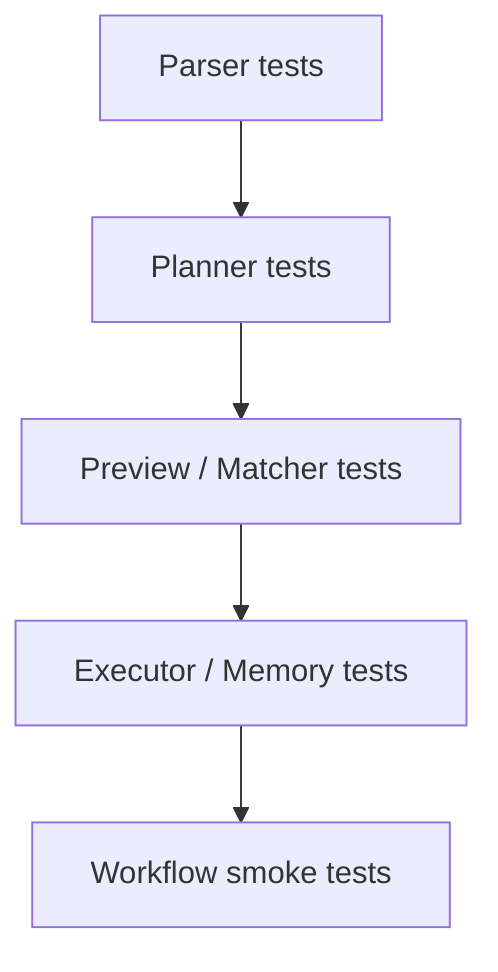
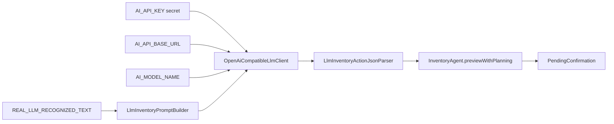
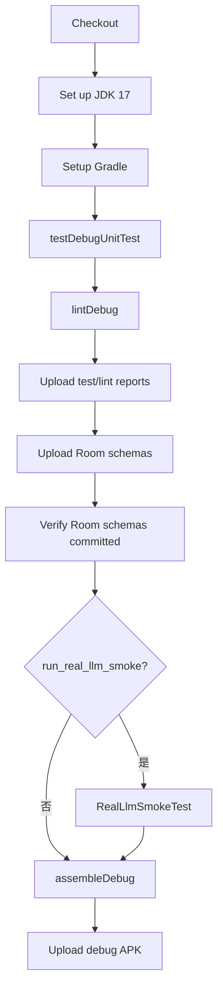

# 07. 测试与 CI：把 agent 的不确定性压到可验证边界里

相关源码和 workflow：

- `app/src/test/java/com/jishiyong/agent/InventoryCommandParserTest.kt`
- `app/src/test/java/com/jishiyong/agent/InventoryAgentTest.kt`
- `app/src/test/java/com/jishiyong/agent/LlmBackedInventoryAgentTest.kt`
- `app/src/test/java/com/jishiyong/agent/llm/LlmInventoryActionJsonParserTest.kt`
- `app/src/test/java/com/jishiyong/agent/InventoryActionExecutorTest.kt`
- `app/src/test/java/com/jishiyong/agent/InventoryAliasMemoryEngineTest.kt`
- `app/src/test/java/com/jishiyong/agent/RoomAgentMemoryStoreTest.kt`
- `app/src/test/java/com/jishiyong/agent/AgentMemorySearchTextTest.kt`
- `app/src/test/java/com/jishiyong/agent/RealLlmSmokeTest.kt`
- `app/src/test/java/com/jishiyong/data/db/AppDatabaseMigrationTest.kt`
- `.github/workflows/build.yml`
- `.github/workflows/llm-smoke.yml`
- `.github/workflows/release.yml`
- `.github/workflows/docs.yml`

## 测试策略

Agent 代码的风险不只在“能不能解析成功”，还在失败路径是否安全。测试应该覆盖四层：



每一层关注的问题不同：

| 层级 | 关注点 | 代表文件 |
| --- | --- | --- |
| Parser | 中文表达、数量、日期、否定、提问 | `InventoryCommandParserTest.kt` |
| Planner | 规则规划、LLM 规划、fallback | `InventoryAgentTest.kt`, `LlmBackedInventoryAgentTest.kt` |
| Preview/Matcher | 库存匹配、多候选、数量不足 | `InventoryAgentTest.kt` |
| Memory | 别名学习、FTS 查询、搜索文本 | `InventoryAliasMemoryEngineTest.kt`, `RoomAgentMemoryStoreTest.kt` |
| LLM JSON | code fence、字段缺失、非法类型 | `LlmInventoryActionJsonParserTest.kt` |

## 不要把真实模型调用放进普通单元测试

普通单元测试应该稳定、快速、可离线运行。真实 LLM 调用会引入：

1. 网络不稳定。
2. API key 依赖。
3. 模型输出变化。
4. 成本和速率限制。

因此项目把真实模型验证放进 smoke workflow：

```bash
gh workflow run llm-smoke.yml \
  --ref main \
  -f ai_api_base_url="https://api.edgefn.net/v1" \
  -f ai_model_name="DeepSeek-V3.2" \
  -f recognized_text="今天喝了一瓶蒙牛纯牛奶"
```

普通 PR 构建仍然跑 JVM 单元测试、lint、Room schema 检查和 debug APK 构建。

`RealLlmSmokeTest` 只有在环境变量满足时才执行真实调用：

```kotlin
assumeTrue(
    "Set RUN_REAL_LLM_SMOKE=true and AI_API_KEY to run the real LLM smoke test.",
    System.getenv("RUN_REAL_LLM_SMOKE") == "true" && apiKey.isNotBlank()
)
```

它默认验证这条链路：



默认文本是“今天喝了一瓶蒙牛纯牛奶”，期望匹配本地构造的“蒙牛纯牛奶”库存，action 是 `ConsumeItem`，数量是 1。

## 当前机器的构建限制

当前本地环境是 `aarch64`。Android Gradle Plugin 会下载 x86-64 `aapt2`，本机执行会遇到 `Exec format error`。因此 Android 构建和测试的权威验证路径是 GitHub Actions。

常用命令：

```bash
gh workflow run build.yml --ref "$(git branch --show-current)"
gh run watch
gh run view --log-failed
```

需要真实 LLM smoke 时：

```bash
gh workflow run build.yml \
  --ref "$(git branch --show-current)" \
  -f run_real_llm_smoke=true
```

## Build workflow 做了什么

`.github/workflows/build.yml` 的主流程：



Room schema 检查很重要：数据库结构变更必须提交 `app/schemas`，否则 CI 会失败。

`build.yml` 的触发条件有三类：

- push 到 `main`。
- pull request 到 `main`。
- 手动 `workflow_dispatch`。

手动触发时可以传入 `run_real_llm_smoke`。如果这个输入为 true，workflow 会要求 secret `AI_API_KEY` 存在，并执行：

```text
./gradlew :app:testDebugUnitTest --tests com.jishiyong.agent.RealLlmSmokeTest
```

其他普通步骤包括：

| 步骤 | 作用 |
| --- | --- |
| `testDebugUnitTest` | 运行 JVM unit test，包括 agent、Room converter、repository 逻辑 |
| `lintDebug` | Android lint |
| 上传 test reports | 失败时下载测试报告 |
| 上传 lint reports | 失败时下载 lint 报告 |
| 上传 room-schemas | 便于检查生成 schema |
| Verify Room schemas are committed | 保证 `app/schemas` 已提交且没有生成差异 |
| `assembleDebug` | 构建 debug APK |
| 上传 debug APK | 保存 30 天 |

当前机器不适合本地 Android Gradle 验证，因此 build workflow 是本仓库 Android 构建、测试和 schema 检查的权威路径。

## Room schema 检查

workflow 中的 schema 检查会失败于两种情况：

1. `app/schemas` 不存在或没有 JSON。
2. Gradle 生成的 schema 与仓库已提交文件不同。

检查逻辑来自 `.github/workflows/build.yml`：

```bash
status="$(git status --porcelain -- app/schemas)"
test -z "$status" || {
  echo "$status"
  echo "Room schemas changed; commit the generated files."
  exit 1
}
```

如果改了 Room entity 或 migration，正确流程是：

1. 让 GitHub Actions 生成并上传 `room-schemas` artifact。
2. 下载 artifact，检查 JSON diff。
3. 如果 schema 变化符合预期，把 `app/schemas` 更新和 migration 一起提交。

不要提交 `app/build/`、APK、下载下来的临时 artifact 或 keystore。

## 关键测试文件怎么读

### InventoryCommandParserTest

这组测试覆盖本地规则 parser。它应该关注：

- 新增、消耗、丢弃关键词。
- 中文数量和单位。
- 购买日期和过期日期。
- 否定、取消、提问表达。
- 没有过期日期时是否澄清。

规则 parser 是无 AI 配置时的默认能力，也是 LLM 请求失败时的 fallback，因此它不是临时替代品。

### LlmInventoryActionJsonParserTest

这组测试覆盖模型输出的防御性解析。重点不是模型会不会按 prompt 输出，而是模型没按要求输出时系统是否安全：

- Markdown code fence。
- 残缺 JSON。
- 缺少过期日期。
- 非法数量。
- 负数数量。
- 只给 `item_id`。
- 消耗数量缺省为 1。

这些测试保证 LLM 输出最终只会变成合法 `InventoryAction` 或 `AskClarification`。

### LlmBackedInventoryAgentTest

这组测试使用 `FakeLlmClient`，不调用真实 provider：

```kotlin
private class FakeLlmClient(
    private val response: String = "",
    private val error: Exception? = null
) : LlmClient {
    val messages = mutableListOf<LlmMessage>()

    override suspend fun complete(messages: List<LlmMessage>, temperature: Double): String {
        this.messages += messages
        error?.let { throw it }
        return response
    }
}
```

它验证的是 agent 编排：

- LLM planner 输出后进入 `PendingConfirmation`。
- `item_id` 优先于名称匹配。
- LLM 请求失败时 fallback 到规则 planner。
- LLM 明确 `ask_clarification` 时不 fallback。
- prompt 包含库存和记忆上下文。
- prompt 不包含 note、purchase date、used quantity 等非必要字段。
- 成功动作会委托给 memory store。

### InventoryAgentTest

这组测试覆盖 preview 和 matcher 组合行为：

- 精确匹配后进入确认。
- 多个候选时进入选择。
- 候选排除剩余数量不足的库存。
- 已无剩余数量的库存不会被匹配。
- 新增动作不需要 `matchedItem`。
- 操作数量大于剩余数量时进入错误。

### InventoryActionExecutorTest

执行器测试用 fake store 覆盖数据库写入前最后一道业务边界：

- 新增插入。
- 部分消耗。
- 完全消耗。
- 丢弃。
- 已处理库存。
- 数量不足。
- 并发冲突。

### Memory tests

记忆测试分三层：

- `InventoryAliasMemoryEngineTest`：学习和相关性打分。
- `AgentMemorySearchTextTest`：FTS token 和 query。
- `RoomAgentMemoryStoreTest`：Room 主表和 FTS 表适配。

这让记忆能力可以在没有真实 LLM 的情况下被验证。

### AppDatabaseMigrationTest

迁移测试创建版本 1 数据库，再执行 `MIGRATION_1_2`。它验证旧库存数据保留，同时新建的 `agent_memories` 和 `agent_memory_fts` 可以写入并搜索。任何后续数据库结构变化都应该补类似测试。

## 文档站验证

文档站使用 MkDocs Material，不依赖 Android SDK，可以本地验证：

```bash
python3 -m pip install --upgrade mkdocs-material
mkdocs build --strict
```

发布到 GitHub Pages：

```bash
gh workflow run docs.yml --ref "$(git branch --show-current)"
```

`docs.yml` 会执行：

1. Checkout。
2. 安装 Python 3.12。
3. 安装 MkDocs Material。
4. `mkdocs build --strict`。
5. 上传 Pages artifact。
6. 部署到 GitHub Pages。

首次发布前，需要在 GitHub 仓库 `Settings -> Pages` 中把 Source 设为 GitHub Actions。配置完成后，`main` 分支上的文档变更会发布到：

```text
https://zarttic.github.io/jishiyong/
```

文档站 workflow 与 Android build workflow 分开，是因为文档只依赖 Python 和 MkDocs，不需要 Android SDK。这样文档改动可以快速发布，不被 Android 构建耗时拖慢。

## LLM smoke workflow

`.github/workflows/llm-smoke.yml` 是单独的 provider 验证入口。它只有 `workflow_dispatch`，输入包括：

| 输入 | 说明 |
| --- | --- |
| `ai_api_base_url` | OpenAI-compatible API base URL |
| `ai_model_name` | 模型名 |
| `recognized_text` | 中文库存指令 |

workflow 会设置：

```text
RUN_REAL_LLM_SMOKE=true
AI_API_KEY=${{ secrets.AI_API_KEY }}
AI_API_BASE_URL=${{ inputs.ai_api_base_url }}
AI_MODEL_NAME=${{ inputs.ai_model_name }}
REAL_LLM_RECOGNIZED_TEXT=${{ inputs.recognized_text }}
```

它只跑 `RealLlmSmokeTest`，不跑完整 lint、schema 和 APK。适用场景是：换 provider、换模型名、改 prompt 主结构后，快速确认真实模型链路可用。

## Release workflow

`.github/workflows/release.yml` 用于发布签名 APK。它要求手动传入：

- `version_name`
- `version_code`
- `release_notes`

并要求这些 secrets 存在：

- `ANDROID_KEYSTORE_BASE64`
- `ANDROID_KEYSTORE_PASSWORD`
- `ANDROID_KEY_ALIAS`
- `ANDROID_KEY_PASSWORD`
- `BAIDU_ASR_APP_ID`
- `BAIDU_ASR_API_KEY`
- `BAIDU_ASR_SECRET_KEY`

release workflow 会：

1. 校验版本号和签名/ASR secret。
2. 解码 keystore 到 runner 临时目录。
3. 跑 `testDebugUnitTest`。
4. 跑 `lintRelease`。
5. 上传测试和 lint 报告。
6. 检查 Room schema。
7. 构建 signed release APK。
8. 生成 sha256。
9. 通过 `gh release create` 或 `gh release upload --clobber` 发布 GitHub Release。

发布命令：

```bash
gh workflow run release.yml \
  --ref main \
  -f version_name=X.Y.Z \
  -f version_code=N \
  -f release_notes="..."
```

## Agent 测试清单

新增或修改 Agent 能力时，至少检查：

| 改动 | 必测内容 |
| --- | --- |
| 新增关键词 | 正向表达、否定表达、提问表达 |
| 新增日期解析 | 今天、明天、具体日期、跨年边界 |
| 修改数量逻辑 | 中文数字、单位、默认数量、非法数量 |
| 修改 LLM prompt | 合法 JSON、澄清动作、不要编造库存 |
| 修改 matcher | 精确匹配、多候选、数量不足、ID 命中 |
| 修改 memory | 学习条件、去重、查询排序、失败降级 |
| 修改 executor | 成功、缺失、已消费、冲突、数量不足 |

如果改动跨越多个层级，不要只补一个“端到端 happy path”。例如新增一个库存动作时，至少应该补：

- parser 正向和否定表达。
- LLM JSON 合法和非法字段。
- preview 匹配和候选选择。
- executor 成功和失败结果。
- UI 展示文案或状态转换。
- 如果涉及数据库，补 migration 和 schema。

## 一个测试写法范式

好的 Agent 测试应该写清楚输入、上下文、期望动作：

```kotlin
@Test
fun parseConsumeCommand() {
    val action = parser.parse("今天喝了一瓶牛奶")

    assertThat(action).isEqualTo(
        InventoryAction.ConsumeItem(
            itemName = "牛奶",
            quantity = 1
        )
    )
}
```

对于 LLM planner，不建议断言自然语言解释，而应该断言结构化动作：

```kotlin
assertThat(action).isInstanceOf(InventoryAction.ConsumeItem::class.java)
```

## 本章练习

为这条输入补测试：

```text
别把牛奶扔了
```

期望结果应该是 `AskClarification`。这个测试能防止否定表达被误判成丢弃动作。

## 学习重点

Agent 测试的目标不是证明模型永远正确，而是证明系统在模型不稳定、网络失败、字段缺失、候选歧义、数据并发变化时仍然安全。普通 unit test 覆盖本地协议和状态机，真实 LLM 只放在手动 smoke，GitHub Actions 承担当前仓库的权威 Android 验证。
