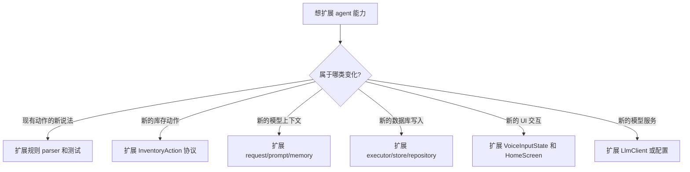

# 08. 扩展指南：从库存 agent 演进出更多能力

相关源码：

- `app/src/main/java/com/jishiyong/agent/InventoryAction.kt`
- `app/src/main/java/com/jishiyong/agent/InventoryActionPlanner.kt`
- `app/src/main/java/com/jishiyong/agent/InventoryCommandParser.kt`
- `app/src/main/java/com/jishiyong/agent/llm/LlmInventoryPromptBuilder.kt`
- `app/src/main/java/com/jishiyong/agent/llm/LlmInventoryActionJsonParser.kt`
- `app/src/main/java/com/jishiyong/agent/InventoryActionPreviewer.kt`
- `app/src/main/java/com/jishiyong/agent/InventoryActionExecutor.kt`
- `app/src/main/java/com/jishiyong/agent/InventoryAliasMemoryEngine.kt`
- `app/src/main/java/com/jishiyong/data/db/AppDatabase.kt`
- `app/src/main/java/com/jishiyong/viewmodel/MainViewModel.kt`
- `app/src/main/java/com/jishiyong/ui/screens/HomeScreen.kt`
- `.github/workflows/build.yml`
- `.github/workflows/llm-smoke.yml`

## 扩展前先确认边界

新增 Agent 能力时，先回答四个问题：

1. 这是新的动作，还是现有动作的新表达？
2. 是否会写数据库？
3. 是否需要用户确认？
4. 是否需要长期记忆？

如果会修改用户数据，默认应该进入“规划 -> 预览 -> 确认 -> 执行”的闭环。

先判断扩展类型，再决定改哪里：



不要一开始就改 prompt。很多需求其实是 parser、matcher、确认状态或执行器的问题。prompt 只能提高理解能力，不能替代本地业务边界。

## 场景一：增加一个本地表达

例如希望“开了一瓶牛奶”识别为消耗。

改动路径：

| 步骤 | 文件 |
| --- | --- |
| 增加关键词 | `InventoryCommandParser.kt` |
| 增加测试 | `InventoryCommandParserTest.kt` |
| 检查否定表达 | `InventoryAgentTest.kt` 或 parser 测试 |

重点不是只测“开了一瓶牛奶”，还要测：

```text
不要开牛奶
要不要开牛奶？
```

它们应该返回澄清，而不是执行消耗。

## 场景二：增加新的库存动作

假设要新增“移动分类”动作。建议按下面顺序做：

1. 在 `InventoryAction` 增加新类型。
2. 在 `InventoryCommandParser` 增加本地解析。
3. 在 LLM prompt 增加 action schema。
4. 在 `LlmInventoryActionJsonParser` 增加 JSON 解析。
5. 在 `InventoryActionPreviewer` 增加预览和校验。
6. 在 `InventoryActionExecutor` 增加执行逻辑。
7. 在 `VoiceInputState` 和 UI 中增加确认展示。
8. 补齐 parser、planner、executor、LLM JSON 测试。

动作协议可能像这样：

```kotlin
data class MoveItemCategory(
    val itemName: String,
    val itemId: Long? = null,
    val targetCategory: ItemCategory
) : InventoryAction()
```

如果需要匹配已有库存，就复用 `InventoryItemMatcher`。如果需要修改字段，就在 Repository 暴露窄接口，不要让 Executor 直接操作 DAO。

更完整的扩展流程如下。

### 1. 扩展 action 协议

`InventoryAction` 是模型和本地工具之间的协议。新增动作时，先把字段定义清楚：

```kotlin
data class MoveItemCategory(
    val itemName: String,
    val itemId: Long? = null,
    val targetCategory: ItemCategory
) : InventoryAction()
```

不要让模型输出 DAO 方法名、SQL、Repository 调用路径或任意字段更新。模型只能输出领域 action。

### 2. 扩展 LLM prompt schema

在 `LlmInventoryPromptBuilder` 的 system prompt 中增加新 action：

```json
{
  "action": "move_item_category",
  "item_id": 12,
  "item_name": "蒙牛纯牛奶",
  "target_category": "DRINK"
}
```

同时写清楚约束：

- `target_category` 必须是已有枚举之一。
- 必须优先使用 `active_inventory` 中真实存在的 id。
- 不确定目标库存或分类时返回 `ask_clarification`。
- 不能编造库存。

### 3. 扩展 JSON parser

在 `LlmInventoryActionJsonParser.parse()` 中增加分支：

```kotlin
"move_item_category" -> parseMoveItemCategory(root)
```

parser 要防御：

- 没有 `item_id` 且没有 `item_name`。
- `target_category` 缺失。
- category 不在枚举中。
- 模型返回空字符串、数字、数组等错误类型。

字段不足时返回 `InventoryAction.AskClarification`，不要猜。

### 4. 扩展规则 parser

如果希望没有 AI 配置时也支持，需要在 `InventoryCommandParser` 中增加关键词和解析方法。比如：

```text
把牛奶分类改成饮品
牛奶放到日用品分类
```

同时要测试否定和提问：

```text
不要把牛奶改分类
要不要把牛奶放到饮品？
```

这两句应该返回澄清，而不是执行移动分类。

### 5. 扩展 previewer

`InventoryActionPreviewer.preview()` 要新增分支：

- 通过 `InventoryItemMatcher` 找库存。
- 多个候选时返回 `NeedsSelection`。
- 找不到时返回错误。
- 分类非法时返回错误。
- 目标分类与当前分类相同，可以提示无需修改或仍进入确认，这取决于产品设计。

无论如何，写入类动作仍然必须进入 `PendingConfirmation`。

### 6. 扩展 executor 和 store

`InventoryActionExecutor.execute()` 增加新分支。`InventoryActionStore` 可以增加窄接口：

```kotlin
suspend fun updateItemCategory(id: Long, category: ItemCategory): InventoryUpdateResult
```

不要让执行器直接操作 DAO。执行器只处理业务结果：

- 成功。
- 库存不存在。
- 库存已处理完成。
- 并发冲突。
- 输入非法。

### 7. 扩展 UI 展示

`HomeScreen.voiceActionTitle()` 和 `voiceActionPreview()` 要展示用户能看懂的变化：

```text
动作：修改分类
结果：蒙牛纯牛奶 分类 饮品 -> 食品
```

不要只展示“AI 已理解”。确认卡片必须展示具体会发生的数据变化。

### 8. 补测试

至少补这些测试：

- `InventoryCommandParserTest`：本地解析、否定、提问。
- `LlmInventoryActionJsonParserTest`：合法 JSON、缺字段、非法分类。
- `LlmBackedInventoryAgentTest`：LLM response 进入确认态，prompt schema 合理。
- `InventoryAgentTest`：匹配、多候选、找不到库存。
- `InventoryActionExecutorTest`：成功、缺失、冲突、非法输入。

如果动作修改了 Room schema，还要补 migration test 并通过 CI 更新 `app/schemas`。

## 场景三：接入新的 LLM 服务

如果新服务兼容 OpenAI Chat Completions，只需要调整配置。

如果不兼容，新增一个 `LlmClient`：

```kotlin
class MyProviderLlmClient(...) : LlmClient {
    override suspend fun complete(
        messages: List<LlmMessage>,
        temperature: Double
    ): String {
        // 调用供应商 API，返回模型 message content
    }
}
```

然后在 `AppContainer.createInventoryAgent()` 中替换 client。

保留这些约束：

1. 返回内容仍然交给 `LlmInventoryActionJsonParser`。
2. 不允许模型直接执行数据库写入。
3. API key 不能打包进 APK。
4. 网络失败必须能 fallback。

如果 provider 不兼容 OpenAI Chat Completions，新增 client 时仍然要保留 `LlmClient` 抽象：

```kotlin
interface LlmClient {
    suspend fun complete(messages: List<LlmMessage>, temperature: Double): String
}
```

provider 特有字段应该留在 client 内部，不要泄漏到 `LlmInventoryActionPlanner`、`InventoryAction` 或 UI。这样 parser、fallback、确认执行链路都可以复用。

新增 provider 后，通过 GitHub Actions 跑真实 smoke：

```bash
gh workflow run llm-smoke.yml \
  --ref main \
  -f ai_api_base_url="https://your-provider.example/v1" \
  -f ai_model_name="your-model" \
  -f recognized_text="今天喝了一瓶蒙牛纯牛奶"
```

## 场景四：增强记忆

当前记忆重点是别名。例如“蒙牛”通常指“蒙牛纯牛奶”。如果要增强记忆，可以考虑：

| 增强方向 | 例子 | 注意事项 |
| --- | --- | --- |
| 偏好记忆 | 用户常用“早餐奶”指饮品分类 | 不要覆盖用户明确输入 |
| 数量习惯 | “一盒”对某品牌默认数量 | 容易出错，必须确认 |
| 位置记忆 | “冰箱里的牛奶” | 需要库存实体支持位置字段 |
| 家庭成员 | “宝宝的药” | 涉及隐私，谨慎设计 |

实现上建议新建 memory type，而不是把所有内容塞进 alias：

```kotlin
private const val MEMORY_TYPE_ALIAS = "ALIAS"
private const val MEMORY_TYPE_LOCATION = "LOCATION"
```

每种 memory type 都应该有独立的 value schema 和测试。

新增记忆类型时，优先保持“短、小、可解释”。不要直接保存完整对话。完整对话的问题是：

- 隐私负担更重。
- 检索噪声更大。
- prompt 变长后成本和稳定性变差。
- 很难解释某条记忆为什么影响了规划。

推荐做法是沿用 `AgentMemoryEntity.type`：

```text
ALIAS
LOCATION
QUANTITY_HINT
CATEGORY_HINT
```

然后在 `RoomAgentMemoryStore` 中按 type 转换为不同领域记忆，再统一输出 `AgentMemory` 给 prompt。UI 层不应该知道这些 memory type 的细节。

必须补的测试：

- engine 学习测试。
- engine 检索和排序测试。
- FTS token 生成测试。
- Room store 写入/读取测试。
- prompt 中 memory JSON 数量和字段裁剪测试。

## 场景五：扩展 prompt 上下文

给模型加上下文时，先问三个问题：

1. 这个字段是否真的影响 action 规划。
2. 这个字段是否可能包含隐私或长文本。
3. 这个字段是否能被测试证明不会误发。

当前 prompt 刻意不发送：

- `note`
- `purchase_date`
- `used_quantity`
- 图片路径
- 创建/更新时间

如果未来要发送位置字段，建议发送结构化、裁剪后的字段，而不是完整备注：

```json
{
  "id": 12,
  "name": "蒙牛纯牛奶",
  "remaining_quantity": 2,
  "expiration_date": "2026-06-12",
  "location_hint": "冰箱"
}
```

同时补一个类似 `promptOmitsNonEssentialPrivateInventoryFields()` 的测试，证明不该发的字段仍然没有发。

## 场景六：扩展 ASR

语音识别相关代码在 `speech/`：

| 文件 | 作用 |
| --- | --- |
| `PcmSpeechRecorder.kt` | 本地录音 |
| `BaiduCloudSpeechRecognizer.kt` | 识别流程封装 |
| `BaiduAsrClient.kt` | 百度 ASR HTTP 调用 |
| `BaiduAsrConfiguration.kt` | 配置读取 |
| `BaiduAsrSettings.kt` | 设置存取 |

当前 UI 入口在 `HomeScreen`，优先使用内嵌 `SpeechRecognizer`，再尝试外部 `RecognizerIntent`，最后在百度 ASR 配置完整时使用云端识别。扩展时要保留这个思想：语音层只负责产出文本，Agent 层只接收文本。


如果要接入其他 ASR 服务，建议先抽象统一接口：

```kotlin
interface SpeechRecognizer {
    suspend fun recognize(pcm: ByteArray): String
}
```

然后让 UI 仍然只拿到 `recognizedText`，后面的 Agent 链路不需要变化。

扩展 ASR 时不要做这些事：

| 不建议 | 原因 |
| --- | --- |
| 在 ASR 层解析库存动作 | 会让同一句文本在不同 Provider 下走不同业务逻辑 |
| 在 ASR 层直接写数据库 | 绕过确认、校验和记忆边界 |
| 把云服务密钥写入源码 | 会泄露密钥，发布 APK 后无法收回 |
| 把识别错误伪造成空文本 | 空文本和服务失败应给出不同用户提示 |

## 场景七：改数据库字段

比如给库存增加“存放位置”。需要同步修改：

1. `Item` entity。
2. Room migration。
3. `app/schemas`。
4. DAO 查询和 Repository 方法。
5. UI 表单和详情展示。
6. Parser/LLM prompt 是否需要提取位置。
7. 测试和 CI schema artifact。

由于当前本机 Android SDK 工具架构不兼容，schema 生成和验证要走 GitHub Actions 或 x86-64 Android SDK 环境。

凡是涉及 Room entity 的变化，都要同步考虑：

- entity 字段。
- DAO 查询和写入方法。
- repository 封装。
- migration。
- `app/schemas`。
- migration test。
- UI 展示和输入。
- prompt 是否需要该字段。

当前数据库版本是 2。新增字段或表时应增加版本号和 migration，比如 `MIGRATION_2_3`。不要只改 entity 后依赖 Room 重建，真实用户设备需要可升级路径。

## 场景八：多轮澄清

当前 `AskClarification` 最终会进入错误展示，提醒用户重说。如果要做真正的多轮澄清，比如：

```text
用户：买了两盒牛奶
系统：什么时候过期？
用户：6 月 12 号
```

就需要新增状态保存 partial action：

```kotlin
data class NeedsClarification(
    val context: VoiceCommandContext,
    val partialAction: InventoryAction?,
    val message: String
) : VoiceInputState()
```

这类改动会影响：

- `InventoryAgent.preview()`
- `MainViewModel.handleVoiceText()`
- `HomeScreen` bottom sheet
- LLM prompt 中是否传入上一轮 partial action
- 状态测试和 UI 测试

不要把多轮信息临时塞进字符串。多轮能力需要明确状态，否则后续很难维护。

## CI 验证

当前机器不适合本地 Android Gradle 构建。扩展后用 GitHub Actions 验证：

```bash
gh workflow run build.yml --ref "$(git branch --show-current)"
gh run watch
```

如果改了 provider、模型名、prompt 主结构或真实模型相关配置，再跑：

```bash
gh workflow run build.yml \
  --ref "$(git branch --show-current)" \
  -f run_real_llm_smoke=true
```

只验证 provider 时：

```bash
gh workflow run llm-smoke.yml \
  --ref main \
  -f ai_api_base_url="https://api.edgefn.net/v1" \
  -f ai_model_name="DeepSeek-V3.2" \
  -f recognized_text="今天喝了一瓶蒙牛纯牛奶"
```

如果 CI 失败：

```bash
gh run view --log-failed
```

Room schema 变化要下载 artifact、检查 diff，并把有意变化提交到 `app/schemas`。不要提交 APK、keystore、secret 或 workflow 临时产物。

## 代码评审清单

提交 Agent 相关改动前，用这张清单自查：

- 是否把“规划”和“执行”分开？
- 是否有用户确认或候选选择？
- 是否处理否定、取消和提问表达？
- 是否有本地规则兜底？
- 是否避免 LLM 编造库存？
- 是否在执行阶段再次校验数量和状态？
- 是否只有成功动作才写入记忆？
- 是否补了失败路径测试？
- 是否没有提交 API key、keystore、APK 或临时 artifact？

更完整的 agent 扩展自查：

- 是否新增或复用了明确的 `InventoryAction`。
- LLM prompt 是否只描述 action schema，不授予数据库写入权。
- JSON parser 是否能把非法模型输出收敛成 `AskClarification`。
- 本地规则 fallback 是否需要同步支持。
- Previewer 是否能校验字段、匹配库存、处理候选选择。
- Executor 是否只接受 `PendingConfirmation`。
- 数据层是否有并发、缺失、数量非法等结果表达。
- UI 是否展示具体变化，而不是只展示模型结论。
- 普通 unit test 是否覆盖协议和状态机。
- 真实 provider 是否只通过手动 smoke 验证。
- GitHub Actions build 是否通过。

## 本章练习

设计一个“修改过期日期”的动作。先不要写代码，只写出：

1. `InventoryAction` 类型。
2. LLM JSON schema。
3. 预览时需要展示的信息。
4. 执行阶段可能失败的结果。
5. 至少 5 条单元测试用例。

如果这五项能写清楚，再开始实现会更稳。

## 学习重点

扩展 agent 不是把更多责任交给模型，而是给模型更清晰的协议，并给本地系统更严格的保护。这个项目的可扩展性来自分层：planner 可以换，prompt 可以调，memory 可以增强，但 `InventoryAction`、preview、confirmation、executor 这条链路必须保持清楚。

只要这条链路不乱，后续可以继续扩展到更多库存动作、更丰富的个性化记忆、更好的多轮澄清，以及更多 OpenAI-compatible provider。
