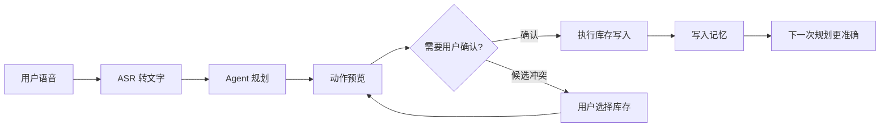

# 及时用 AI Agent 文档

这套文档围绕一个 Android 库存管理应用展开，目标不是只展示一个能运行的功能，而是把“语音输入如何变成可靠的库存动作”拆成可学习、可测试、可扩展的 Agent 工程过程。

你会看到一个完整闭环：



## 适合谁阅读

这套文档适合三类读者：

| 读者 | 你会重点学到什么 |
| --- | --- |
| 想入门 AI Agent 的开发者 | Agent 的观察、规划、确认、执行、记忆闭环如何落到真实业务 |
| Android 开发者 | 如何把语音、ViewModel、Room、LLM 和 Compose UI 组织在一起 |
| 想做工程化落地的人 | 如何把 LLM 放在可控边界内，并用规则兜底、测试和 CI 降低风险 |

## 先建立一个判断标准

本项目里的 Agent 不是“聊天机器人”，它也不会直接替用户改数据库。它的职责是：

1. 接收用户自然语言和当前库存上下文。
2. 规划出一个结构化库存动作。
3. 在真正写入前做校验、匹配、候选选择和用户确认。
4. 执行成功后学习别名记忆，帮助下次理解用户表达。

核心动作定义在 `app/src/main/java/com/jishiyong/agent/InventoryAction.kt`：

```kotlin
sealed class InventoryAction {
    data class AddItem(val draft: ItemDraft) : InventoryAction()
    data class ConsumeItem(
        val itemName: String,
        val quantity: Int,
        val itemId: Long? = null
    ) : InventoryAction()
    data class DiscardItem(
        val itemName: String,
        val quantity: Int,
        val itemId: Long? = null
    ) : InventoryAction()
    data class AskClarification(val message: String) : InventoryAction()
}
```

这个接口很关键：LLM、本地规则、UI、执行器都围绕它协作。教学时可以把它当成 Agent 的“工具调用协议”。

## 学习路线

建议按下面顺序阅读：

1. [Agent 开发总览](01-agent-overview.md)：先理解这个项目里的 Agent 边界。
2. [项目架构](02-architecture.md)：看清 UI、ViewModel、Agent、Room、LLM 的依赖关系。
3. [语音到动作](03-voice-to-action-flow.md)：从录音、识别文本、状态流到确认执行完整走一遍。
4. [解析与规划](04-parser-and-planner.md)：拆解本地规则、LLM 规划、混合兜底和库存匹配。
5. [LLM 接入](05-llm-integration.md)：学习 OpenAI-compatible 接入、Prompt 结构和 JSON 防御性解析。
6. [记忆与确认执行](06-memory-confirmation.md)：理解别名记忆、Room FTS、确认流和写入安全边界。
7. [测试与 CI](07-testing-and-ci.md)：看哪些地方必须测试，为什么本机不跑 Android Gradle 构建。
8. [扩展指南](08-extension-guide.md)：按工程步骤扩展新动作、新 Provider、新记忆策略。

## 源码地图

| 路径 | 作用 |
| --- | --- |
| `app/src/main/java/com/jishiyong/agent/` | Agent 核心：动作、解析、规划、匹配、执行、记忆 |
| `app/src/main/java/com/jishiyong/agent/llm/` | LLM Prompt、OpenAI-compatible client、JSON action parser |
| `app/src/main/java/com/jishiyong/speech/` | 录音与百度云 ASR 配置、客户端 |
| `app/src/main/java/com/jishiyong/viewmodel/MainViewModel.kt` | 语音状态机和库存操作入口 |
| `app/src/main/java/com/jishiyong/data/db/` | Room 数据库、DAO、实体、迁移、schema |
| `app/src/test/java/com/jishiyong/agent/` | Agent 单元测试与真实 LLM smoke test |
| `.github/workflows/` | Android build、release、LLM smoke、文档发布 workflow |

## 运行和验证的现实约束

当前开发机器是 `aarch64`，Android Gradle Plugin 会下载 x86-64 `aapt2`，因此本机 Android 构建会遇到架构不兼容。权威 Android 构建和测试通过 GitHub Actions 执行。

常用命令：

```bash
gh workflow run build.yml --ref "$(git branch --show-current)"
gh run watch
gh run view --log-failed
```

文档站不依赖 Android SDK，可以本地构建：

```bash
python3 -m pip install --upgrade mkdocs-material
mkdocs build --strict
```

## 第一个练习

阅读 `InventoryAgent.previewWithPlanning()`，回答两个问题：

1. 为什么 Agent 在规划前要读取 `relevantMemoriesFor()`？
2. 为什么规划失败时返回的是 `VoiceInputState.Error`，而不是直接抛异常到 UI？

这两个问题会贯穿后续章节：一个对应“记忆”，一个对应“可靠性边界”。
